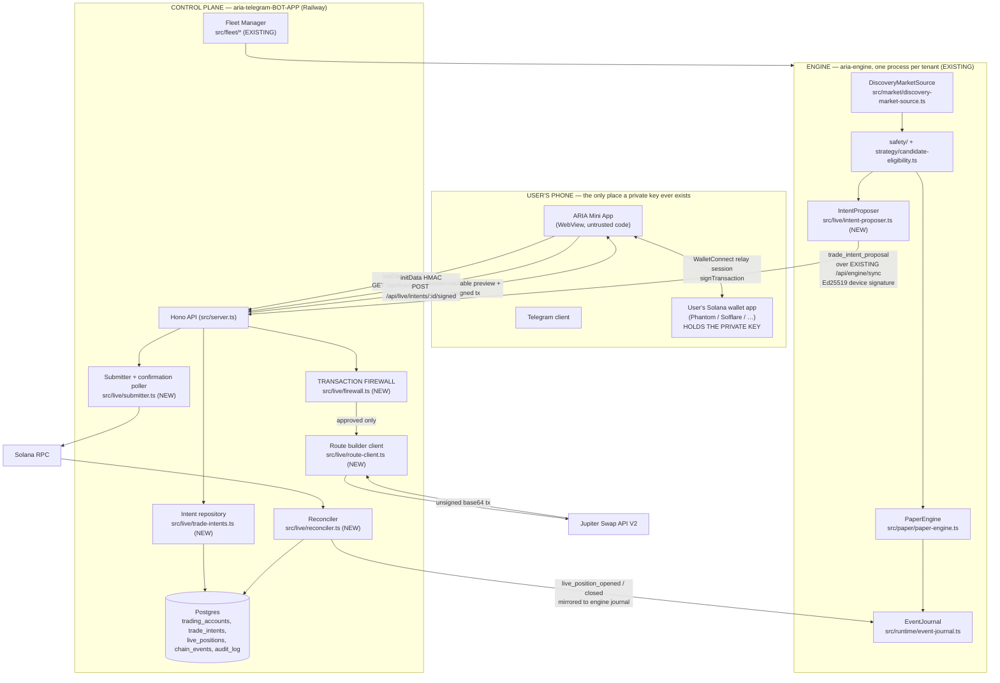
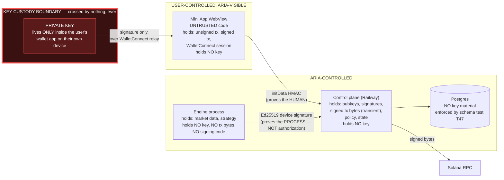

# SPEC — LIVE Vertical Slice 0.1 (Founding Beta, non-custodial)

**Status:** DESIGN PROPOSAL — awaiting owner approval. No implementation authorized by this
document. Nothing here has been built.
**Branch:** `plan/live-vertical-slice-0.1`
**Date:** 2026-09-19
**Repos in scope:** `aria-telegram-BOT-APP` (control plane + Mini App + Fleet Manager),
`aria-engine` (strategy/PAPER/journal).

---

## 0. Governance position and how this relates to the standing authorization

The standing governance record for LIVE execution is
`aria-engine/docs/REAL2_EXECUTION_STATE.md` (last updated 2026-09-06). This spec is written
to be a **strict subset** of what that document authorizes, and is deliberately more
conservative than it in one respect.

| REAL2_EXECUTION_STATE.md authorized scope | LIVE 0.1 position |
|---|---|
| TradeIntent | **In scope.** §5. |
| execution routing | In scope, but delegated to Jupiter Swap API V2 route construction (§7); ARIA writes no instruction-building code in 0.1. |
| Pump/PumpSwap transaction construction | **Deliberately NOT built in 0.1.** Resolved in §7 in favour of a third-party unsigned-transaction builder. The already-built curve math is reused as an *independent price oracle*, not as an instruction builder. |
| Jupiter routing where appropriate | In scope — and it is the *only* route in 0.1. |
| Jito Block Engine delivery | **NOT in 0.1.** §10. Plain RPC delivery only. |
| execution fee/tip policy | Partially — priority fee only, no Jito tip. §15. |
| transaction firewall | **In scope, mandatory.** §6. |
| **dedicated local trading wallet** | **NOT in 0.1.** Explicitly narrower than the authorization. |
| **local signer** | **NOT in 0.1.** Explicitly narrower than the authorization. |
| signing authorization boundary | In scope — but the boundary is the *user's own wallet app*, §2/§8. |
| transaction simulation | In scope, as a firewall input. §6 check F16. |
| submission / confirmation / UNKNOWN / reconciliation | In scope. §11–§14. |
| position ledger / exits / restart recovery / HARD STOP | In scope. §17–§20. |
| founder-only LIVE canary | In scope. §26. |

**The narrowing is deliberate and should be read as a decision, not an omission.** The
authorization permits a dedicated local trading wallet with a local signer. LIVE 0.1 does
not build one. Reason: a local signer is a key-custody surface, and every one of the
authorization's *NOT authorized* bullets (cloud custody, remote storage of private key /
seed) is a statement about key material. A design in which **ARIA never holds any key
material of any kind, anywhere, in any form** cannot violate those bullets even under
implementation error. That property is worth more at slice 0.1 than automated signing is,
and automated signing is precisely what 0.1 does not need — a founder certifying a single
round trip can tap "Sign" in their wallet.

REAL2_EXECUTION_STATE.md's hard exclusions that this spec must and does honour:

- no public LIVE access → §27 gating, founder-only then explicit allowlist.
- no custody of user private keys → structurally impossible, §2, §Trust boundary diagram.
- no cloud-side signing → no signing code exists anywhere in either repo under this spec.
- no storing wallet secrets in Telegram / Railway / Postgres / logs / analytics / Mini App
  → §2.6 storage table enumerates every field persisted; none is secret material.
- no bypassing PAPER validation → §27 G1 requires a passing `aria audit-paper` run.
- no turning on real trading before independent verification → §26, §27.
- no moving ordinary beta users into LIVE automatically → `trading_accounts` rows do not
  exist until a user explicitly creates one; `live_enabled` defaults false; §1.

**Plain statement of risk, which no part of this document may be read as softening: LIVE
trading loses money. The controls in this spec limit *exposure*, not *outcomes*. A user
who enables LIVE 0.1 can lose the entire balance they fund, including to causes none of
these controls address (a rug pull, a honeypot that passes every safety evaluator, a chain
halt, a mispriced route).**

---

## 1. Component and data-flow architecture

### 1.1 The three-party split

LIVE 0.1 has exactly three parties and the boundaries between them are the whole design.



### 1.2 Where each responsibility lives, and why

| Responsibility | Where | Why not elsewhere |
|---|---|---|
| Find a candidate, evaluate safety, decide "this is worth trading" | **Engine** (existing `DiscoveryMarketSource` → `evaluateCandidate` → `evaluateCandidateEligibility`) | This pipeline is already real, already live-verified, and already journaled. LIVE must hook into it, not fork it. |
| Propose a TradeIntent | **Engine**, new `IntentProposer` | The engine is where the market evidence exists. It only ever *proposes*. |
| Authorize a TradeIntent | **Control plane firewall** | The engine process is spawned per-tenant by the Fleet Manager and its device keypair is **server-generated** (hosted mode, per the hosted-engine LEDGER Task 4). A device signature therefore proves *which process*, never *which human*. Authorization cannot live there. |
| Build the unsigned transaction | **Control plane**, via Jupiter | §7. |
| Show the user what they are signing | **Mini App**, from a control-plane-rendered preview | §9. |
| Sign | **User's wallet app only** | The entire point. |
| Submit | **Control plane** | §10. Submission must be observable by the party that owns the state machine. |
| Confirm / recover UNKNOWN / reconcile | **Control plane** | §11–§14. |
| Create a position, compute PnL | **Control plane reconciler**, mirrored into the engine journal | §16, §17. Only reconciled chain truth may create a position. |

### 1.3 The single most important security consequence of the hosted-engine design

The hosted-engine LEDGER (Task 4, 2026-09-18) records that for a hosted tenant, ARIA's
server **generates the Ed25519 device keypair itself** and pre-seeds it into the tenant's
runtime directory. `/api/engine/sync`'s `verifyDeviceSignature` therefore authenticates a
process ARIA itself provisioned.

**Therefore: a valid device signature on a `trade_intent_proposal` is not, and must never
be treated as, user authorization to spend money.** It authenticates provenance and
provides replay protection; that is all. The only things that constitute authorization in
LIVE 0.1 are:

1. a current, versioned consent record (§3), plus
2. a `trading_accounts` row in state `ARMED` (§1 state machine), plus
3. a live, `initData`-authenticated Mini App action by the human, plus
4. a signature produced by the private key ARIA does not hold.

All four. Any one of them missing is a firewall rejection.

---

## 2. TradingAccount and the wallet-connection model

### 2.1 State machine

```mermaid
stateDiagram-v2
  [*] --> UNCONFIGURED
  UNCONFIGURED --> CONNECTED: E1 wallet ownership proven
  CONNECTED --> FUNDED: E2 on-chain balance >= min, observed by ARIA's own RPC
  FUNDED --> CONNECTED: E2' balance fell below min (automatic, on any refresh)
  FUNDED --> READY: E3 risk policy persisted + consent version current
  READY --> FUNDED: consent version superseded, or policy cleared
  READY --> ARMED: E4 explicit human ARM action, initData-verified
  ARMED --> PAUSED: E5 user pause, OR automatic on any breach
  ARMED --> READY: E6 arm window expired
  PAUSED --> ARMED: E4 (re-arm; requires all E1-E3 evidence still valid)
  ARMED --> STOPPED: E7 emergency stop
  PAUSED --> STOPPED: E7
  READY --> STOPPED: E7
  FUNDED --> STOPPED: E7
  CONNECTED --> STOPPED: E7
  STOPPED --> [*]: terminal for this account row
```

`STOPPED` is **terminal**. There is no `STOPPED → *` edge. Recovering from an emergency
stop means creating a new `trading_accounts` row, which re-walks every gate from
`UNCONFIGURED`. This is chosen over a resume edge because an emergency stop is, by
definition, a state in which our model of the world was wrong; resuming into that model is
the mistake the stop existed to prevent.

### 2.2 The evidence gates — "a user cannot become ARMED merely because the UI requested it"

Every transition is a server-side function that **derives** the new state from stored
evidence. The Mini App can only *request* a transition. `POST /api/live/account/arm` does
not set `state = 'ARMED'`; it calls `recomputeAccountState(accountId)` which returns the
highest state the evidence supports, and fails the request if that is below `ARMED`.

| Gate | Evidence required, all server-side |
|---|---|
| **E1 CONNECTED** | A row in `wallet_ownership_proofs` for this account whose `verified_at` is non-null. Proof = a WalletConnect `solana_signMessage` over a server-issued nonce (see §2.4). The server re-verifies the Ed25519 signature against the claimed pubkey using `node:crypto` — the same primitive `device-auth.ts` already uses. A client-asserted "I connected" is not evidence. |
| **E2 FUNDED** | `getBalance(pubkey)` from **ARIA's own RPC**, at `confirmed` commitment, observed within `ACCOUNT_BALANCE_FRESHNESS_SECONDS` (60), `>= min_funded_lamports`. Never a client-reported balance. Recorded as `last_observed_balance_lamports` + `last_balance_observed_at`. |
| **E3 READY** | A non-null `risk_policy_id` pointing at a `live_risk_policies` row that passes `validateRiskPolicy()` (§4), **and** `consent_version = CURRENT_CONSENT_VERSION` with `consent_accepted_at` non-null. |
| **E4 ARMED** | E1∧E2∧E3 all still true *at the moment of the call* (re-derived, not cached), plus an `initData`-verified POST from the Telegram user whose `users.id` owns this account, plus `armed_until = now + arm_window_seconds`. Arming is **time-boxed**; §2.3. |
| **E5 PAUSED** | Either an explicit user pause, or any automatic trip: daily-loss ceiling reached, N consecutive `FAILED` intents, any intent resolving to `UNKNOWN` (§12 — an unresolved UNKNOWN pauses the account, full stop), or a consent version bump. |
| **E6** | `now > armed_until`. Evaluated lazily on read *and* by the firewall; no cron required (same lazy-expiry discipline `engine_commands.expires_at` already uses). |
| **E7 STOPPED** | Any of: user emergency stop, admin stop, or an integrity failure (§20). |

### 2.3 Why arming is time-boxed

An `ARMED` account is a standing authorization to *present* the user with signable
transactions. If that authorization never expired, a user who armed once and forgot would
be permanently in a state where ARIA can push a sign-prompt at them. `arm_window_seconds`
defaults to 3600 and is capped at 86400. Expiry is a demotion to `READY`, not a
destruction of any state — re-arming is one tap.

### 2.4 Wallet ownership / connection model — researched, not assumed

The naive assumption — "use `@solana/wallet-adapter` as on desktop" — **does not work** in
a Telegram Mini App, and the reason is specific.

**What the research establishes:**

1. A Mini App runs inside Telegram's own WebView. Browser-extension wallets are not
   present, so `@solana/wallet-adapter`'s injected-provider detection finds no provider
   and the standard modal shows nothing connectable
   ([Phantom discussion #266](https://github.com/orgs/phantom/discussions/266)).
2. The documented Phantom answer is **deeplinks** — but deeplinks have a hard
   incompatibility with Mini Apps: Telegram permits a Mini App to be re-entered with
   exactly one parameter (`startapp`), while Phantom's deeplink return carries several
   query parameters (encrypted payload, nonce, public key, or an error). The community
   workaround is to bounce the user *out of Telegram* to a standalone redirect page that
   absorbs the multi-parameter return, then offer a button back into the Mini App
   (ibid.).
3. The alternative, and the one the Mini App ecosystem has converged on, is an **HTTP/relay
   bridge** rather than a redirect: WalletConnect (Reown AppKit), which works in Telegram
   bots and Mini Apps with no redirect round trip, and which supports Solana namespaces
   including `solana_signTransaction` / `solana_signMessage`
   ([Reown](https://reown.com/learn/how-to-build-a-telegram-mini-app),
   [Reown AppKit Telegram integration](https://docs.reown.com/appkit/integrations/telegram-mini-apps)).
   Bitget's Mini App guide states the same constraint in general terms: the JS bridge
   provider is unavailable inside a Mini App, so an HTTP bridge (WalletConnect / TON
   Connect) is the connection mechanism
   ([Bitget](https://web3.bitget.com/en/docs/guide/telegram-webapps/)).

**Decision: WalletConnect (via Reown AppKit's Solana adapter) is the sole connection
mechanism in LIVE 0.1. Phantom deeplinks are explicitly rejected.**

Reasoning, stated as a tradeoff rather than a preference:

| | WalletConnect relay | Phantom deeplink |
|---|---|---|
| Return flow into the Mini App | **None needed** — the Mini App never closes; the signature arrives over the relay session. | Requires an out-of-Telegram bridge page + a manual "return" tap. Two context switches per signature. |
| Wallet coverage | Any WalletConnect-compatible Solana wallet. | Phantom only; a second integration per additional wallet. |
| Session reuse across BUY and SELL | One session covers both legs and the whole trading session. | Every signature is a fresh deeplink round trip. |
| Failure mode when the user abandons mid-sign | Relay request times out; intent goes `EXPIRED` cleanly. | User is stranded on an external page outside Telegram; recovery UX is genuinely bad. |
| Cost | A Reown project ID; a relay dependency ARIA does not control. | No third party in the loop. |
| Dependency risk | **Real.** The relay is a liveness dependency. Mitigated because relay unavailability can only prevent a signature, never produce a wrong one — it is a liveness, not a safety, dependency. |

The deeplink path's two-context-switch cost is disqualifying against §Commercial framing's
requirement that a normal mobile Telegram user can complete the flow. The relay's liveness
risk is acceptable because it is confined to liveness.

**P0-WALLET-1 (launch blocker, §"P0"):** the exact WalletConnect Solana namespace method
set must be verified empirically against at least two real wallets on a real phone before
founder certification. Specifically: whether the wallet returns a *signed but unsubmitted*
transaction via `solana_signTransaction`, or insists on `solana_signAndSendTransaction`.
**LIVE 0.1's architecture requires `solana_signTransaction`** — ARIA must own submission
(§10), because a wallet that submits on ARIA's behalf takes the SUBMITTED boundary out of
ARIA's hands and makes §12's UNKNOWN recovery materially harder (ARIA might not even learn
the signature). If a target wallet only offers sign-and-send, that wallet is **out of
scope for 0.1** and the Mini App must say so before the user funds anything, rather than
discovering it at the sign step. This is a research task with a real chance of a negative
answer and must not be assumed away.

### 2.5 Reuse vs. new table — resolved

`migrations/1755238500000_create-wallet-accounts.js` already defines `wallet_accounts`
with `authority_model ∈ {delegated_vendor, delegated_program}`, an opaque `authority_ref`,
and a partial unique index `wallet_accounts_one_active_per_user`.

Both options were weighed:

- **Reuse `wallet_accounts`** by adding a `self_custody` enum member. Pro: inherits the
  one-active-wallet-per-user invariant as a *database* constraint, and `deposits` already
  FKs to it. Con: the table's own docblock says "`wallet_accounts.status = 'active'` gates
  signing", which is a delegated-custody sentence that is simply false for a self-custody
  row — ARIA does not gate signing for a wallet it cannot sign with.
- **A new `trading_accounts` table.** Pro: no false inherited semantics. Con: duplicates
  the wallet-identity concept.

**Decision: both, split by concern.** `wallet_accounts` gains a `self_custody` enum member
and continues to own *wallet identity* (the pubkey, one active per user, the FK target for
`deposits`). The new `trading_accounts` owns *the LIVE trading relationship* — state
machine, risk policy, consent, arming, balance observation — and FKs to `wallet_accounts`.
The migration also amends the `wallet_accounts` docblock in the new migration's comment so
the "gates signing" sentence is not left standing as a lie for self-custody rows. Nothing
about the delegated path changes; this is purely additive.

### 2.6 Everything persisted about a wallet — the exhaustive list

To make "no secrets stored" auditable rather than asserted, this is the complete set of
wallet-derived fields LIVE 0.1 writes anywhere:

| Field | Table | Secret? |
|---|---|---|
| `solana_pubkey` | `wallet_accounts` | No — public key. |
| `ownership_nonce`, `ownership_signature_b64`, `verified_at` | `wallet_ownership_proofs` | No — a signature over a nonce ARIA issued. Cannot be replayed (nonce is single-use, bound to `account_id`, 300s TTL) and cannot be used to derive the key. |
| `last_observed_balance_lamports` | `trading_accounts` | No. |
| `signed_transaction_b64` | `trade_intents` | No — a signed transaction is a bearer instrument *for that one transaction only*. It is nonetheless treated as sensitive: §19 requires it be nulled after the intent reaches a terminal state, and it must never be logged. |
| `tx_signature` | `trade_intents` | No — public. |

No seed phrase, no private key, no keypair, no PKCS8 blob, no mnemonic, in any table, log,
analytics event, Telegram message, or Mini App `localStorage`. The WalletConnect session
topic/key material lives in the Mini App's own WebView storage and is never transmitted to
ARIA — **P0-WALLET-2**: an automated test must assert no `/api/live/*` request body schema
contains a field capable of carrying it.

---

## 3. Consent versioning

```
CURRENT_CONSENT_VERSION = "live-0.1-2026-09-19"
```

A single monotonic string constant in `src/config.ts`, alongside `TIER_LIMITS`
(per this repo's convention that such values live in exactly one place). The risk
disclosure text itself is a versioned file, `public/legal/live-risk-disclosure-<version>.md`,
committed to the repo — **the accepted text must be recoverable from the version string
forever**, which a database row alone does not guarantee.

`live_consents` records `(user_id, account_id, consent_version, accepted_at, text_sha256,
initdata_telegram_user_id, user_agent)`. `text_sha256` is the SHA-256 of the exact bytes
served to the user, computed server-side at serve time and re-checked at accept time — so
"which words did they agree to" is answerable by hash, not by trusting that the file was
never edited in place.

Later reference: every `trade_intents` row carries `consent_version` **copied at creation**,
not joined at read time. An intent is forever associated with the disclosure version in
force when it was created, even after the constant bumps.

Bumping the constant: every `trading_accounts` row whose `consent_version` is stale is
demoted `ARMED/READY → FUNDED` on its next `recomputeAccountState`, and the firewall's
check F5 fails closed for any in-flight intent. No migration is needed; the demotion is
derived.

---

## 4. Risk-policy representation

New table `live_risk_policies`, one row per policy version, **immutable once referenced**
(a `trade_intents` row points at a `risk_policy_id`, so the exact limits an intent was
judged against are permanently recoverable). "Editing" limits inserts a new row and repoints
`trading_accounts.risk_policy_id`.

```ts
// src/live/risk-policy.ts (NEW)
export interface LiveRiskPolicy {
  id: string;                              // uuid
  accountId: string;
  // sizing
  maxTradeLamports: bigint;                // per-intent notional ceiling
  maxOpenPositions: number;                // 1 in 0.1's default envelope
  maxTotalExposureLamports: bigint;        // sum of open positions' reconciled entry cost
  // loss control
  maxDailyRealizedLossLamports: bigint;    // UTC day, same dayKeyUtc() boundary as PAPER
  // execution quality
  maxSlippageBps: number;                  // 1..5000
  maxExecutionCostLamports: bigint;        // priority fee + est. network fee, absolute
  maxExecutionCostBpsOfTrade: number;      // AND-ed with the absolute ceiling
  // pacing
  mintCooldownSeconds: number;
  globalCooldownSeconds: number;           // NEW vs PAPER — a per-account floor between ANY two intents
  // envelope
  minReserveLamports: bigint;              // wallet must retain this much SOL post-trade
  createdAt: string;
  supersededAt: string | null;
}
```

Three deliberate differences from `PaperConfig`:

1. **`globalCooldownSeconds` is new.** PAPER has only `mintCooldownSeconds`. PAPER cannot
   run out of money; a LIVE account can be drained by many small trades on *different*
   mints, each individually within every per-mint limit. A per-account floor between any
   two intents is the control that closes that.
2. **`minReserveLamports` is new, and it is the gap PAPER explicitly deferred.**
   `paper-risk.ts` documents, in a comment, that minimum-reserve is DEFERRED because
   "PAPER's capital model has no canonical wallet-balance concept to derive it from."
   **LIVE has one** — `trading_accounts.last_observed_balance_lamports`, from ARIA's own
   RPC. This spec closes that deferral, and the closure is only possible in LIVE. Default
   0.01 SOL, enough to pay for the exit leg's fees; a position you cannot afford to sell
   is not a position, it is a donation.
3. **Execution-cost ceilings are AND-ed, absolute and proportional.** An absolute ceiling
   alone is wrong for a tiny trade (10,000 lamports of priority fee on a 0.01 SOL trade is
   1% of notional); a proportional ceiling alone is wrong for a large one. Both apply;
   whichever binds first, binds.

`validateRiskPolicy()` rejects: any non-positive money field, `maxSlippageBps` outside
[1, 5000], `maxOpenPositions` outside [1, 10], `maxTradeLamports > maxTotalExposureLamports`,
`maxTradeLamports + minReserveLamports > last_observed_balance_lamports`. **Founding Beta
additionally hard-caps every field server-side** (§Risk envelope) — the user may configure
*more* conservative than the cap, never less.

---

## 5. TradeIntent — schema, state machine, idempotency

### 5.1 The boundary rule

**TradeIntent is the mandatory boundary between strategy and money.** Concretely, this is
enforceable and must be enforced by a test, not a convention:

- `aria-engine` contains no code that constructs, signs, or submits a transaction. The
  existing `contracts.test.ts` PAPER-ONLY recursive guardrail already asserts this and
  **must not be weakened by this work** — `IntentProposer` produces a plain JSON object and
  hands it to the existing sync client. It imports nothing from `@solana/web3.js` beyond
  types already in use.
- The control plane contains no code that decides *whether a trade is a good idea*. It only
  decides whether a proposed trade is *permitted*. The firewall is a permission gate, not
  a second strategy.

### 5.2 State machine

```mermaid
stateDiagram-v2
  [*] --> CREATED: engine proposal accepted at /api/engine/sync
  CREATED --> REJECTED: firewall denied (terminal)
  CREATED --> APPROVED: firewall passed, route built, preview rendered
  APPROVED --> AWAITING_SIGNATURE: delivered to Mini App
  AWAITING_SIGNATURE --> SIGNED: signed tx received + server-verified
  AWAITING_SIGNATURE --> EXPIRED: expires_at passed (terminal)
  APPROVED --> EXPIRED
  CREATED --> EXPIRED
  SIGNED --> SUBMITTED: sendRawTransaction returned a signature
  SIGNED --> FAILED: submission rejected pre-flight (terminal)
  SIGNED --> UNKNOWN: submission call errored/timed out with no usable response
  SUBMITTED --> CONFIRMED: signature status confirmed, err == null
  SUBMITTED --> FAILED: signature status confirmed, err != null (terminal)
  SUBMITTED --> UNKNOWN: confirmation deadline passed with no status
  UNKNOWN --> CONFIRMED: recovery found a landed, successful tx
  UNKNOWN --> FAILED: recovery found a landed, failed tx, OR proved expiry
  UNKNOWN --> UNKNOWN: recovery inconclusive; retry with backoff
  CONFIRMED --> RECONCILED: chain truth parsed, deltas computed (terminal, success)
  CONFIRMED --> UNKNOWN: reconciliation could not parse the transaction
  RECONCILED --> [*]
```



Hard rules, each of which must have its own failing test before implementation:

1. **`UNKNOWN` is never collapsed into `FAILED`.** There is no code path, anywhere, that
   sets `FAILED` because a timeout elapsed. `FAILED` requires either a pre-flight
   rejection, or a *retrieved* `err != null`, or a *proof* of non-inclusion (§12 step 5).
2. **`SUBMITTED` is not success.** Nothing in the UI, the Telegram DM, or any API response
   may render `SUBMITTED` as "done", "bought", or a position.
3. **`CONFIRMED` is not a position.** Only `RECONCILED` creates one (§13).
4. **Timeout is not failure.** Restated because it is the single most common way systems
   of this shape lose money twice.
5. **An account with any intent in `UNKNOWN` cannot enter `ARMED`.** Firewall check F17.
   One unresolved unknown freezes new trading for that account until a human or the
   recovery loop resolves it.

### 5.3 Schema

```ts
// src/live/trade-intent-types.ts (NEW) — shared shape; the engine gets a
// proposal-only subset (fields marked ENGINE), the control plane owns the rest.
export type TradeIntentState =
  | "CREATED" | "REJECTED" | "APPROVED" | "AWAITING_SIGNATURE" | "SIGNED"
  | "SUBMITTED" | "CONFIRMED" | "RECONCILED" | "FAILED" | "UNKNOWN" | "EXPIRED";

export interface TradeIntent {
  intentId: string;            // uuid, CONTROL PLANE assigns — never the engine
  userId: number;              // users.id
  accountId: string;           // trading_accounts.id
  wallet: string;              // base58 pubkey, copied from the account at creation
  mint: string;                // ENGINE
  side: "BUY" | "SELL";        // ENGINE
  amountLamports: bigint;      // ENGINE (BUY: SOL in). SELL: null, see amountTokenRaw
  amountTokenRaw: bigint | null; // SELL: exact token base units out. BUY: null
  expectedPrice: { quoteLamports: bigint; baseUnits: bigint }; // ENGINE, PaperPrice shape
  minOutputRaw: bigint;        // CONTROL PLANE, derived from expectedPrice + slippage
  slippageBps: number;         // CONTROL PLANE, min(policy ceiling, engine request)
  strategyReason: string;      // ENGINE, e.g. "eligibility:pass|curve-priced"
  marketEvidence: Readonly<Record<string, unknown>>; // ENGINE — the SafetyReport summary +
                               // eligibility decision, same shape DiscoveryMarketSource
                               // already journals for "eligibility-evaluated"
  marketObservationTimestamp: number;  // ENGINE, UnixMs — the observedAtMs of the
                               // observation this intent is derived from, NOT proposal time
  marketObservationSlot: number;       // ENGINE
  createdAt: number;
  expiresAt: number;           // createdAt + INTENT_TTL_MS
  idempotencyKey: string;      // §5.4
  // lifecycle
  state: TradeIntentState;
  rejectionCode: FirewallRejectionCode | null;
  riskPolicyId: string;
  consentVersion: string;
  // route + execution (populated at APPROVED and later)
  routeProvider: "jupiter-v2" | null;
  routeQuote: Readonly<Record<string, unknown>> | null;
  unsignedTxB64: string | null;
  txMessageHashHex: string | null;  // §9.4 — binds preview to bytes
  recentBlockhash: string | null;
  lastValidBlockHeight: number | null;  // §12 — the expiry proof
  signedTxB64: string | null;       // nulled at terminal state
  txSignature: string | null;
  submittedAt: number | null;
  confirmedAt: number | null;
  reconciledAt: number | null;
}
```

**Why `marketObservationTimestamp` is separate from `createdAt`:** the engine's own
freshness discipline (`PAPER_ENTRY_FRESHNESS_SECONDS = 10` in `paper-risk.ts`) measures
staleness from *observation*, not from *decision*. If the firewall measured from
`createdAt`, a proposal that sat in a sync queue for 30 seconds would look fresh. The
firewall's check F13 uses `marketObservationTimestamp`, exactly as `evaluatePaperRisk`
step 1 does.

### 5.4 Idempotency — the exact key and the exact layer

```
idempotencyKey = sha256(
  accountId || "\x00" ||
  mint      || "\x00" ||
  side      || "\x00" ||
  marketObservationSlot.toString() || "\x00" ||
  candidateId
)
```

Enforced at **three** layers, deliberately, because each catches a different failure:

| Layer | Mechanism | Catches |
|---|---|---|
| **Database** | `UNIQUE (idempotency_key)` on `trade_intents` | The only one that holds under concurrency and process crash. A retried proposal is an `ON CONFLICT DO NOTHING` returning the existing row. Modeled directly on `journal_entries.idempotency_key`, which this repo already uses for exactly this purpose in the ledger. |
| **Sync protocol** | The existing strictly-increasing `atomicAdvanceSequence` on `/api/engine/sync` | A replayed *envelope*. Already built, already tested; LIVE adds nothing here. |
| **Chain** | One `recentBlockhash` per intent, never re-fetched (§12 rule) | Double *execution*. Two submissions of the same signed bytes are the same signature; the chain dedupes. A resigned transaction with a fresh blockhash would be a different signature and is therefore forbidden. |

**Deliberately NOT used as the idempotency key:** the transaction signature. It does not
exist at `CREATED`, which is the point at which duplicates must already be impossible.

**Deliberately NOT included in the key:** `createdAt`. Including a timestamp would make
every retry unique, which defeats the entire mechanism — this is the classic way
idempotency keys are silently rendered useless and must be called out in the implementer's
test: *"two proposals from the same observation produce byte-identical keys."*

---

## 6. The Transaction Firewall

### 6.1 Position and contract

```ts
// src/live/firewall.ts (NEW)
export function evaluateFirewall(
  intent: TradeIntentProposal,
  context: FirewallContext,
): FirewallDecision;

export type FirewallDecision =
  | { approved: true; evidence: FirewallEvidence; effectiveSlippageBps: number }
  | { approved: false; code: FirewallRejectionCode; evidence: FirewallEvidence };
```

Modeled deliberately on `evaluatePaperRisk`'s contract (`src/paper/paper-risk.ts`): a
**pure function that never mutates state**, returning a typed decision that **always
carries evidence, on approval as well as rejection**. That discipline is the reason
PAPER's risk decisions are auditable, and it is not re-invented here — it is copied.

**Placement: the firewall runs before transaction construction, and again before
submission.** Two invocations, not one:

- **Pass 1 (pre-construction)**, at `CREATED`: every check except those requiring a route.
  A rejection here means no third-party API call is ever made for a trade that was never
  going to be allowed.
- **Pass 2 (pre-submission)**, at `SIGNED → SUBMITTED`: **every check re-run**, plus the
  route-dependent ones, plus F18 (the signed bytes are the approved bytes). This is the
  pass that matters, because between pass 1 and pass 2 a human tapped a button, time
  passed, the balance may have moved, and the account may have been stopped.

A single-pass design was rejected: it would authorize based on a world-state that is
guaranteed to be stale by the time money moves.

### 6.2 The checks

`UNCERTAIN = REJECT` is the default for every check. Any input the firewall cannot
*positively establish* — an RPC call that errored, a balance older than its freshness
window, a route quote that failed to parse — is a rejection, never a pass-through.

| # | Check | Rejection code | Notes |
|---|---|---|---|
| F1 | `intent.userId` owns `intent.accountId` | `WRONG_USER` | Re-queried, never trusted from the payload. |
| F2 | `intent.wallet` equals the account's *current* active `wallet_accounts.solana_pubkey` | `WRONG_WALLET` | Catches a wallet swapped between proposal and signature. |
| F3 | Global `LIVE_ENABLED` flag AND per-account `live_enabled` | `LIVE_DISABLED` | Two independent kill switches; §20. |
| F4 | Account state is `ARMED` and `now < armed_until` | `ACCOUNT_NOT_ARMED` | |
| F5 | `account.consent_version == CURRENT_CONSENT_VERSION` | `CONSENT_STALE` | |
| F6 | Balance observed within 60s, `>= amountLamports + estExecutionCost + minReserve` | `INSUFFICIENT_BALANCE` | A stale balance is `UNCERTAIN` → reject. |
| F7 | `amountLamports <= policy.maxTradeLamports` AND `<= FOUNDING_BETA_HARD_CAP` | `TRADE_SIZE_EXCEEDED` | |
| F8 | Reconciled open exposure + this trade `<= policy.maxTotalExposureLamports` | `EXPOSURE_EXCEEDED` | Exposure counts **RECONCILED positions plus intents in any non-terminal state at or past `APPROVED`** — the LIVE analogue of `paper-exposure-ledger.ts`'s `pendingExposureLamports`, and for the identical reason: two near-simultaneous intents must never both see the same headroom. |
| F9 | Open position count + pending `< policy.maxOpenPositions` | `POSITION_COUNT_EXCEEDED` | |
| F10 | Today's reconciled realized PnL `> -policy.maxDailyRealizedLossLamports` | `DAILY_LOSS_LIMIT` | Uses `dayKeyUtc()` — **imported from `paper-risk.ts`**, not re-implemented, so LIVE and PAPER can never disagree about where a day starts. |
| F11 | `now - lastIntentAtForMint >= mintCooldownSeconds` | `MINT_COOLDOWN` | |
| F12 | `now - lastIntentAtForAccount >= globalCooldownSeconds` | `GLOBAL_COOLDOWN` | |
| F13 | `now - marketObservationTimestamp <= LIVE_ENTRY_FRESHNESS_SECONDS` | `STALE_OBSERVATION` | Default 10s, matching `PAPER_ENTRY_FRESHNESS_SECONDS`. |
| F14 | Route's every program id ∈ `ALLOWED_PROGRAM_IDS`; mint ∈ allowed-source set | `UNSUPPORTED_ROUTE` | §7.4. Pass 2 only. |
| F15 | `effectiveSlippageBps <= policy.maxSlippageBps`, AND the route's own quoted price is within `MAX_ORACLE_DIVERGENCE_BPS` of ARIA's independently computed curve price | `SLIPPAGE_EXCEEDED` / `ORACLE_DIVERGENCE` | §7.3 — this is where the already-built `pump-curve-pricing.ts` earns its place in LIVE. |
| F16 | `simulateTransaction` succeeds, and its reported compute/err is clean | `SIMULATION_FAILED` | Pass 2 only. A simulation that *errors on the RPC side* is `UNCERTAIN` → reject. |
| F17 | No intent for this account is in state `UNKNOWN` | `ACCOUNT_HAS_UNKNOWN_INTENT` | §5.2 rule 5. |
| F18 | The signed transaction's message bytes hash-equal `txMessageHashHex` | `SIGNED_BYTES_MISMATCH` | Pass 2 only. §9.4 — this is the check that makes "no hidden mutation after approval" real rather than aspirational. |
| F19 | `now < expiresAt` | `INTENT_EXPIRED` | |
| F20 | `INSERT ... ON CONFLICT (idempotency_key)` did not find an existing row | `DUPLICATE_INTENT` | §5.4. |
| F21 | Estimated execution cost `<= maxExecutionCostLamports` AND `<= maxExecutionCostBpsOfTrade` of notional | `EXECUTION_COST_EXCEEDED` | §15. |

Every decision — approved or rejected — writes an `audit()` row (this repo's standing
convention: *"Every DB mutation calls `audit()`"*) and a `live_intent_evaluated` journal
event carrying the full `FirewallEvidence`, mirroring `paper-engine.ts`'s
`risk-evaluated` emission which fires on **every** call, accepted or rejected.

---

## 7. The first transaction route — decision and reasoning

### 7.1 Candidates considered

| Option | What ARIA would write | Verdict |
|---|---|---|
| **A. Hand-built Pump/PumpSwap instructions** (via `@pump-fun/pump-sdk`, or by hand on top of the existing `pump-decoder.ts` / `pumpswap-decoder.ts`) | Instruction construction, ATA creation/idempotency, curve-vs-AMM branching on graduation state, Token-2022 handling, account-ordering correctness | **Rejected for 0.1.** |
| **B. A third-party unsigned-transaction builder** (bloXroute Trader API's pump.fun `swap`, which explicitly returns an unsigned transaction and does not submit) | An HTTP client | Rejected — narrower coverage than C, and a paid credential ARIA does not have (the same class of blocker `REAL2_EXECUTION_STATE.md` already records for Yellowstone/Jito). |
| **C. Jupiter Swap API V2** — `/order` for a quote + unsigned base64 transaction, `/build` for custom transactions; ARIA signs nothing, submits itself | An HTTP client and a base64 deserializer | **CHOSEN.** |

### 7.2 Why C

1. **It is the smallest reliable route because ARIA writes no instruction-building code at
   all.** Jupiter's `/order` returns a *base64 unsigned transaction*
   ([Jupiter docs](https://developers.jup.ag/docs/guides/how-to-build-a-swap-with-ultra)),
   which is precisely the artifact a non-custodial flow needs: something to show the user
   and hand to their wallet. Option A's surface — ATAs, graduation branching, account
   ordering — is a large quantity of code whose failure mode is *losing real money on the
   first trade*, for zero benefit at slice 0.1.
2. **One code path spans the bonding curve and the graduated AMM.** A pump.fun token
   migrates to PumpSwap at full bonding, and a hand-built integration must branch on that
   state and get the branch right at exactly the moment the token is most volatile.
   Jupiter routes across pump.fun, PumpSwap and Raydium behind one interface, so
   graduation is not an ARIA correctness concern in 0.1.
3. **Both legs, one integration.** BUY and SELL are the same call with reversed mints.
   Option A needs the exit leg to be independently correct, and the exit leg is the one
   that must work when things are going badly.
4. **Version note, verified not assumed:** Ultra **V1 is deprecated**; the current surface
   is Swap API V2, `/order` (managed execution) and `/build` (custom transactions) (ibid.).
   **The implementer must re-verify the live endpoint shape at implementation time** — this
   API has already renamed itself once inside the research window, so treating today's
   paths as stable would be exactly the "stale knowledge" failure this spec is supposed to
   avoid. **P0-ROUTE-1.**

### 7.3 What this does NOT discard — the already-built curve code

`pump-curve-pricing.ts`, `pump-curve-state.ts`, `pump-fee-resolver.ts` and
`pump-fee-config.ts` are **not superseded** by choosing Jupiter. They change role:

- They remain the engine's **pricing** source (already wired: `DiscoveryMarketSource`
  populates `PaperCandidate.feeOverrideBps` from `pump-fee-resolver.ts`, and produces
  curve-derived prices marked `pricedFromCurve`).
- In LIVE they gain a second, new role: **an independent oracle used by firewall check
  F15 to cross-examine the third party's quote.** If Jupiter's quoted execution price
  diverges from ARIA's own curve-derived price by more than
  `MAX_ORACLE_DIVERGENCE_BPS` (default 300), the intent is rejected `ORACLE_DIVERGENCE`.

This is the strongest argument for option C rather than a weakness of it: ARIA gets the
safety of not writing instruction code **and** keeps a genuinely independent view of the
price, which a pure-Jupiter integration would not have. Work already done is not thrown
away; it is promoted from "our only price" to "our check on someone else's price."

### 7.4 Allowlist, not blocklist

`ALLOWED_PROGRAM_IDS` is an explicit set (pump.fun bonding curve, PumpSwap AMM, the SPL
token programs, ATA program, compute budget program, system program). F14 rejects a route
touching anything else. A route through an unexpected program is `UNCERTAIN` → reject, even
if Jupiter considers it optimal. 0.1 trades a narrow, known universe or it does not trade.

### 7.5 What of Jupiter's `/execute`?

**Not used.** Jupiter's managed execution would have ARIA post the signed transaction back
to Jupiter for submission and landing. Rejected because it moves the SUBMITTED→CONFIRMED
boundary into a third party: ARIA would learn outcomes second-hand, and §12's UNKNOWN
recovery — which depends on ARIA knowing the signature and the `lastValidBlockHeight` and
being able to query the chain directly — would be built on someone else's retry semantics.
ARIA accepts a third party for *route construction* (a pure function of market state,
independently checkable by F15/F16) and refuses one for *state ownership*.

---

## 8. The signing flow inside Telegram

```
1. Engine proposes  ──sync──▶ control plane. Firewall pass 1. Route built. Preview rendered.
2. Telegram DM:     "ARIA found a setup. [Review & Sign]"  (deep-links into the Mini App
                     with startapp=<intentId>  — ONE parameter, which Telegram supports.)
3. Mini App opens, GET /api/live/intents/:id (initData HMAC), renders the §9 preview.
4. User taps Sign.  Mini App calls the ALREADY-ESTABLISHED WalletConnect session's
                     solana_signTransaction with the unsigned base64 from step 3.
5. Wallet app opens (WalletConnect deeplink to the wallet), user approves, wallet returns
                     the signed transaction OVER THE RELAY. The Mini App is still open:
                     nothing depends on a redirect carrying parameters back into Telegram.
6. Mini App POSTs the signed transaction to /api/live/intents/:id/signed.
7. Firewall pass 2 (all checks + F18 byte-binding). Submit. §10.
```

Notes that matter and were researched rather than assumed:

- **Step 2 uses `startapp`, which carries exactly one parameter** — the intent id. This is
  within Telegram's documented single-parameter constraint, which is the same constraint
  that breaks the Phantom-deeplink *return* path. ARIA's outbound deep link is fine; it is
  the *inbound return* that deeplink wallets cannot do, and step 5 avoids needing one.
- **The WalletConnect session is established at account-connection time (§2.4), not
  per-trade.** Step 4 reuses it. A per-trade pairing would put a QR code in front of a
  mobile user, which is the classic desktop-pattern mistake.
- **Step 5 still opens the wallet app**, which is a context switch — but the user returns
  by the ordinary OS back gesture into a Mini App that never lost state, rather than
  through a bridge page.
- **P0-WALLET-1 again:** if the tested wallets only expose `solana_signAndSendTransaction`,
  step 5–7 do not work as written and the flow must be re-specified before certification.

---

## 9. Transaction construction boundary and what the user sees

### 9.1 Who builds

`src/live/route-client.ts` (control plane) is the **only** component that calls the route
API and the only one that holds an unsigned transaction before the user sees it. The engine
never sees transaction bytes. The Mini App never constructs anything — it receives bytes
and a preview, and returns bytes.

### 9.2 The preview contract

The preview is **rendered server-side** and delivered as structured data plus a
server-computed display string. The Mini App may style it but must not compute it — a
client that computes its own "you will receive" number can disagree with the bytes.

```ts
export interface IntentPreview {
  side: "BUY" | "SELL";
  assetSymbol: string | null;          // null when unknown — never a guess
  assetMint: string;                   // always shown in full, never truncated
  inputDisplay: string;                // "0.0100 SOL"
  expectedOutputDisplay: string;       // "1,234,567.89 FOO"
  minimumOutputDisplay: string;        // "1,209,876.53 FOO  (worst case)"
  slippageLimitDisplay: string;        // "2.00%"
  estimatedFeesDisplay: string;        // "network 0.000005 SOL + priority 0.000100 SOL"
  estimatedTotalCostDisplay: string;   // input + all fees
  routeDisplay: string;                // "pump.fun bonding curve (via Jupiter)"
  riskWarning: string;                 // fixed text, versioned with the consent version
  expiresAtDisplay: string;            // "expires in 45s"
  intentId: string;
}
```

`minimumOutputDisplay` is mandatory and non-collapsible. A user who only sees the expected
output has not been told the actual commitment they are making; `minOutputRaw` is the only
number the chain will enforce.

### 9.3 Required negative-space rules

- No "estimated profit", no projected return, no win-rate, anywhere in the sign flow.
- `assetSymbol` is `null` rather than invented when metadata is unavailable, and the UI
  shows the mint alone. Inventing a symbol is how users sign for the wrong token.
- If any fee component cannot be estimated, the preview says "unknown" and the firewall's
  F21 rejects (`UNCERTAIN = REJECT`) — the user is never shown a fabricated zero. This is
  the same discipline `trading-journal.ts` already applies by reporting live-only fields as
  N/A rather than fabricating them.

### 9.4 No hidden mutation after approval

At `APPROVED`, the server computes `txMessageHashHex = sha256(transaction.message.serialize())`
and stores it. At pass 2, the server deserializes the *signed* transaction, re-serializes
its message, and compares. Mismatch → `SIGNED_BYTES_MISMATCH`, terminal rejection.

This closes both directions: a compromised or buggy Mini App cannot substitute different
bytes after the preview, **and** ARIA cannot substitute different bytes after the user
approved — the second of which matters more, because it is the promise ARIA is making to
the user and it should be mechanically verifiable rather than trusted.

---

## 10. RPC / delivery boundary

**Route construction and delivery are separate components with separate interfaces.**
`route-client.ts` produces bytes. `submitter.ts` delivers bytes. `submitter.ts` has no
knowledge of what a swap is; it takes a signed transaction and a `lastValidBlockHeight` and
returns a signature or an error.

This separation exists so that adding Jito later is a change to one file that implements
the same `Deliverer` interface, and cannot become a change to strategy. **Jito is delivery,
not strategy** — it affects *when and whether* a transaction lands, never *whether the
trade is a good idea*.

**0.1 uses plain `sendRawTransaction` against ARIA's configured RPC. No Jito, no bundles,
no tips, no multi-route racing.** Reasons: Jito requires a block-engine credential
`REAL2_EXECUTION_STATE.md` already records as a standing blocker; bundles add a second,
different failure mode (bundle-not-landed vs. transaction-not-landed) on top of §12, which
is already the hardest part of this spec; and a founder certifying one round trip does not
need MEV protection.

Delivery parameters: `maxRetries: 0` on `sendRawTransaction` (ARIA owns retry policy —
§12 rule 3 — and the RPC's own silent rebroadcast makes the submission boundary fuzzy),
`skipPreflight: false` (preflight rejection is a clean, early `FAILED`), commitment
`confirmed`.

---

## 11. Confirmation state machine and its exact parameters

```
SUBMITTED at t0, with lastValidBlockHeight = LVBH (from the blockhash used).

Poll getSignatureStatuses([sig], { searchTransactionHistory: false }) every
  CONFIRM_POLL_INTERVAL_MS = 2000
until whichever comes first:

  (a) status != null && status.err == null && confirmationStatus ∈ {confirmed, finalized}
        → CONFIRMED
  (b) status != null && status.err != null
        → FAILED   (a retrieved error, the only clean path to FAILED post-submission)
  (c) getBlockHeight() > LVBH
        → the blockhash can no longer be included. Go to §12 with the
          "expiry candidate" flag. NOT FAILED yet — a transaction can land in the
          same slot the height is read.
  (d) t0 + CONFIRM_HARD_DEADLINE_MS = 90_000 elapsed
        → UNKNOWN

Every poll writes nothing but a `last_polled_at`; state transitions are the only writes.
```

`CONFIRM_HARD_DEADLINE_MS = 90s` is chosen as ~1.5× the practical outer bound of blockhash
validity (150 slots ≈ 60s) plus RPC lag margin — long enough that ordinary congestion does
not manufacture UNKNOWNs, short enough that a user is not left staring at a spinner. It is
a **configured constant with a documented basis, not a derived value**, and should be
revised against real observations from founder certification (§26 step 7 records it).

Condition (c) is why `lastValidBlockHeight` is a persisted column on `trade_intents` rather
than a runtime variable: after a crash, the recovery loop needs it to reason about expiry
at all, and it is unrecoverable from the signature alone.

---

## 12. UNKNOWN recovery — the algorithm

This is the hardest part of the spec and the part most likely to lose money if it is wrong.
The failure to avoid is: a transaction that *did* land is treated as failed, ARIA retries,
and the user buys twice.

### 12.1 Invariants

1. **No blind resubmission, ever.** There is no code path that calls `sendRawTransaction`
   with bytes that were already submitted once, except the single narrow case in step 4
   below, which resubmits the *byte-identical* transaction (same signature — the chain
   deduplicates, so it is provably not a second execution).
2. **Never re-sign.** A new blockhash means a new signature means a genuinely possible
   double execution. Resolving an UNKNOWN never involves asking the user to sign again.
   If an intent is proven expired, the correct action is a **new intent**, with a new
   idempotency key, that goes through the entire firewall again from `CREATED`.
3. **Bounded.** `MAX_RECOVERY_ATTEMPTS = 20` over `RECOVERY_MAX_WINDOW_MS = 30 min`, with
   exponential backoff (2s → 60s cap). On exhaustion the intent stays `UNKNOWN` — it is
   **not** promoted to `FAILED` — the account is `PAUSED`, and a Telegram DM plus an
   operator alert fires. An unresolvable UNKNOWN is a human's problem, honestly surfaced.

### 12.2 The algorithm

```
resolveUnknown(intent):

  STEP 1 — Ask the chain about the signature directly. AUTHORITATIVE.
    getSignatureStatuses([sig], { searchTransactionHistory: true })
      • err == null, confirmationStatus ∈ {confirmed, finalized}  → CONFIRMED. done.
      • err != null                                              → FAILED. done.
      • null → continue. (Not evidence of absence; only of "not in the recent cache".)
    RPC error → return INCONCLUSIVE (do NOT advance). Retry later.

  STEP 2 — Ask for the transaction itself. ALSO AUTHORITATIVE, different index path.
    getTransaction(sig, { maxSupportedTransactionVersion: 0, commitment: "confirmed" })
      • non-null, meta.err == null → CONFIRMED (and step 13's reconciliation input is
                                     already in hand — reuse this response, don't refetch).
      • non-null, meta.err != null → FAILED.
      • null → continue.
    Steps 1 and 2 are run against a DIFFERENT RPC endpoint from each other where the
    fallback list (aria-engine's existing rpc.fallbackUrls mechanism) permits. A single
    lagging RPC reporting "not found" is the most likely cause of a false negative, and
    two independent endpoints agreeing is materially stronger evidence than one.

  STEP 3 — Expiry proof. The ONLY way a not-found transaction becomes FAILED.
    if getBlockHeight() > intent.lastValidBlockHeight + EXPIRY_SAFETY_SLOTS (=150):
        The blockhash is definitively unusable, and we have waited a further ~60s of
        slots beyond the boundary for any in-flight inclusion to surface in step 1/2.
        → FAILED (reason: "blockhash-expired-not-found"). done.
    else: continue.

  STEP 4 — Rebroadcast the IDENTICAL bytes, at most once per recovery attempt, and only
    while the blockhash is still valid. Same signature ⇒ cannot double-execute.
    Purpose: recover from a submission that never actually reached a leader.
    Skipped entirely if step 3's window has passed.

  STEP 5 — Balance-delta corroboration. CORROBORATING ONLY, NEVER DECIDING.
    Compare the wallet's current SOL and token balances against the pre-submission
    snapshot (persisted at SIGNED — see §18).
      • A delta consistent with this trade RAISES the priority and frequency of steps
        1–2 and is recorded in the audit trail as a strong hint.
      • A delta is NEVER sufficient to declare CONFIRMED, and this is a deliberate,
        load-bearing refusal: the user controls this wallet. They may have traded the
        same mint manually, in another app, from another device, during the window.
        Attributing an unattributed balance change to ARIA's transaction would create a
        position ARIA does not own and a PnL figure that is fiction.
      • An ABSENT delta is likewise not evidence of failure.
    Corroboration is written to the audit log as evidence, never to `state`.

  STEP 6 — Still inconclusive → schedule the next attempt with backoff. The intent stays
    UNKNOWN. The account stays PAUSED. Nothing is shown to the user as resolved.
```

### 12.3 The decision table, stated once, explicitly

| Signature status | `getTransaction` | Blockhash expired + safety margin | Resolution |
|---|---|---|---|
| `err == null` | — | — | **CONFIRMED** |
| `err != null` | — | — | **FAILED** |
| not found | found, `meta.err == null` | — | **CONFIRMED** |
| not found | found, `meta.err != null` | — | **FAILED** |
| not found | not found | **yes** | **FAILED** (proved, not timed out) |
| not found | not found | no | **UNKNOWN**, retry |
| RPC error | any | any | **UNKNOWN**, retry (never FAILED) |

---

## 13. BUY reconciliation

`CONFIRMED → RECONCILED` is a single function over a single `getTransaction` response.
**It is the only place a `live_positions` row is ever created.**

```
reconcileBuy(intent, tx /* the getTransaction response, versioned tx supported */):

  1. Assert tx.meta.err == null. Otherwise this is not a CONFIRMED transaction; abort
     and re-derive state (defensive; should be unreachable).

  2. Locate the wallet's index in tx.transaction.message.accountKeys (static + loaded
     addresses for v0 transactions — a v0 transaction with address-lookup tables MUST be
     handled, since Jupiter routes commonly use them. An implementation that only reads
     staticAccountKeys will silently mis-index. RED test required.)

  3. solDelta      = meta.postBalances[i]  - meta.preBalances[i]        // negative for BUY
     networkFee    = meta.fee                                          // lamports, authoritative
     tokenDeltaRaw = postTokenBalance(mint, owner=wallet) - preTokenBalance(...)
                     // both from meta.pre/postTokenBalances, matched on BOTH mint AND owner.
                     // Matching on mint alone is wrong: a route can touch pool-owned token
                     // accounts for the same mint.

  4. Assert tokenDeltaRaw > 0. A "successful" BUY with no token received is an integrity
     failure → §20 HARD STOP, not a position.

  5. priorityFeeLamports = the compute-budget SetComputeUnitPrice instruction's price
     × the units actually consumed (meta.computeUnitsConsumed), computed from the
     transaction ITSELF, not from what ARIA estimated at preview time.
     jitoTipLamports = 0n in 0.1 (no Jito). Recorded as a real 0, not undefined, because
     "we did not use Jito" is a known fact, unlike "we don't know."

  6. actualEntryCostLamports = -solDelta
     // NOTE: solDelta already includes meta.fee and the priority fee, because both are
     // debited from this same account. networkFee and priorityFee are therefore recorded
     // as BREAKDOWN of actualEntryCost, never added to it again. Double-counting fees here
     // is the single easiest way to produce a PnL that is quietly wrong in the user's
     // favour, and must have its own RED test.

  7. effectiveEntryPrice = { quoteLamports: actualEntryCost - allFees, baseUnits: tokenDeltaRaw }
     // PaperPrice's two-integer shape, reused exactly — no floats.

  8. INSERT live_positions (...) and UPDATE trade_intents SET state='RECONCILED'
     in ONE transaction. §18.
```

## 14. SELL reconciliation

```
reconcileSell(intent, tx):
  1..3 as above.
  4. Assert tokenDeltaRaw < 0 and |tokenDeltaRaw| == the position's quantity (full exit
     only in 0.1 — partial exits are NOT built, §"Will not build").
  5. solDelta > 0 expected. actualExitProceedsLamports = solDelta
     (again already net of meta.fee and priority fee — same non-double-counting rule).
  6. realizedPnlLamports = position.actualEntryCostLamports  ⊖  computed per §16.
  7. UPDATE live_positions SET closed..., UPDATE trade_intents SET state='RECONCILED',
     INSERT the journal event — ONE transaction.
```

A SELL whose `tokenDelta` is smaller than the position (a partial fill through a route that
could not source full liquidity) is an **integrity failure in 0.1**: it means ARIA's model
of the position no longer matches the chain. It sets the position to a
`PARTIALLY_EXITED_NEEDS_ATTENTION` state, pauses the account, and alerts. It does not
silently adjust the quantity and carry on.

---

## 15. Fee and slippage accounting — relation to the Stage-4 PAPER model

`src/paper/jito-paper-model.ts` defines:

```ts
export interface JitoPaperExecutionCost {
  priorityFeeLamports: bigint;
  jitoTipLamports: bigint;
  totalFixedCostLamports: bigint;
  simulatedLatencyMs: number;
  latencySlippageBps: number;
}
```

**The data shape carries over verbatim. The values do not, and the source of the values is
the entire difference.**

| Field | PAPER (Stage 4) | LIVE 0.1 |
|---|---|---|
| `priorityFeeLamports` | A configured flat estimate (`config.jitoPriorityFeeLamports`) standing in for a compute-unit count PAPER cannot know | **Computed from the confirmed transaction**: the SetComputeUnitPrice value × `meta.computeUnitsConsumed`. |
| `jitoTipLamports` | Configured flat amount | **`0n`** — no Jito in 0.1. A real, known zero. |
| `totalFixedCostLamports` | Sum of the two | Sum of the two. Same arithmetic. |
| `simulatedLatencyMs` | A configured constant | **Renamed `observedLatencyMs`**: `confirmedAt - submittedAt`, genuinely measured. |
| `latencySlippageBps` | Derived from the configured latency × a configured rate | **Not modeled.** In LIVE, latency-driven price movement is not a separate cost — it is already fully contained in the realized difference between `expectedPrice` and `effectiveEntryPrice`. Modeling it *again* would double-count. This field is therefore **absent** from the LIVE type, not zero. |

Implementation consequence: a shared interface `ExecutionCost` is extracted with the first
four fields; `JitoPaperExecutionCost` extends it with `latencySlippageBps`;
`LiveExecutionCost` does not. This is a real, small refactor of `jito-paper-model.ts` that
**must not change any PAPER behaviour** (its existing tests are the regression guard).

`totalPaperExecutionCostLamports` on `PaperAccountSnapshot` has a direct LIVE analogue,
`total_execution_cost_lamports` on `trading_accounts`, tracked separately from protocol
fees for the identical stated reason: *"so each economically distinct cost component stays
independently auditable rather than merged into one bucket."*

---

## 16. The canonical realized-PnL formula

```
REALIZED_PNL = ACTUAL_EXIT_PROCEEDS − ACTUAL_ENTRY_COST − ALL_RECONCILED_EXECUTION_COSTS
```

where every term is derived **exclusively** from a `getTransaction` response for a landed
transaction. A quote, a preview number, an `expectedPrice`, a mark, or a route's claimed
output may **never** appear in this formula.

### 16.1 How it differs from PAPER, precisely

`paper-accounting.ts` computes:

```ts
computeRealizedPnl(entryCostLamports, exitNetProceedsLamports) =
  exitNetProceedsLamports - entryCostLamports
```

where `entryCostLamports` came from `computeEntryCost(quoteLamports, feeBps)` — that is,
*modelled* from a quoted price and a basis-point fee rate, with a documented conservative
rounding rule (costs round up, proceeds round down).

The arithmetic is **identical**. The provenance is **opposite**.

| | PAPER | LIVE |
|---|---|---|
| Entry cost | `quoteLamports + applyBpsRoundUp(quote, feeBps)` — derived from a price observation | `-solDelta` from the confirmed transaction |
| Exit proceeds | `gross - applyBpsRoundUp(gross, feeBps)` | `+solDelta` from the confirmed transaction |
| Rounding | Conservative rounding needed, because the numbers are estimates | **No rounding at all.** The chain's lamport deltas are exact integers. Applying `applyBpsRoundUp` to a reconciled number would *introduce* error, not guard against it. |

### 16.2 What code is shared — the real decision

**Shared:** `computeRealizedPnl`, `computeUnrealizedPnl`, `netReturnBps`, `dayKeyUtc`.
These are pure integer arithmetic over lamports and are correct regardless of provenance.
LIVE imports them from `paper-accounting.ts` / `paper-risk.ts` — sharing them is what makes
"a 10% gain means the same thing in PAPER and LIVE" true by construction rather than by
review.

**Not shared:** `computeEntryCost`, `computeExitProceeds`, `applyBps`, `applyBpsRoundUp`.
These *model* fees from a bps rate. LIVE has no use for them and **must be prevented from
acquiring one** — a test asserts no file under `src/live/` imports them. A future
maintainer reaching for `computeEntryCost` in LIVE is reaching for an estimate where a fact
is available, and the test is there to stop them.

**Cross-repo note:** this arithmetic lives in `aria-engine`, and the reconciler lives in
`aria-telegram-BOT-APP`. There is no shared package. The hosted-engine LEDGER already
flagged this exact coupling risk for `local-keystore.ts`'s on-disk format. The same
mitigation applies: the LIVE reconciler re-implements these four functions in
`src/live/live-accounting.ts` **with a test that asserts byte-identical results against a
committed table of vectors also asserted by `aria-engine`'s own tests**. Duplicating four
lines of integer arithmetic with a shared golden-vector test is safer than a cross-repo
import that no compiler checks.

---

## 17. Position ledger integration — reuse `OpenPaperPosition` or not?

**Decision: a separate `LivePosition` type. `OpenPaperPosition` is not extended.**

Both options were genuinely weighed.

*Extend `OpenPaperPosition` with optional LIVE fields.* Pro: one type, one set of exit
logic, no duplication. Con — and it is decisive: `paper-types.ts` opens with an explicit,
load-bearing contract — *"There is no type here, and there must never be one, that
represents a real transaction, a real signature, a real fill, or real custody. Search this
file for 'signature', 'blockhash', 'instruction', or 'keypair' — none exist, on purpose."*
`paper-hard-stop.test.ts` and the recursive `contracts.test.ts` guardrail enforce it. A
`txSignature?: string` field on `OpenPaperPosition` would break that contract, and the
"optional" modifier is exactly how such a boundary erodes: every downstream consumer now
has to remember which mode it is in.

*Separate `LivePosition`.* Con: two position types. Mitigated, because the duplication is
confined to the *shape*, and the *logic* is shared:

```ts
// src/live/live-position-types.ts (NEW, control plane)
export interface LivePosition {
  positionId: string;
  accountId: string;
  userId: number;
  mint: string;
  symbol: string | null;
  // provenance — every one of these is why this type cannot live in paper-types.ts
  entryIntentId: string;
  entryTxSignature: string;
  entrySlot: number;
  exitIntentId: string | null;
  exitTxSignature: string | null;
  // reconciled truth only
  quantityRaw: bigint;
  decimals: number;
  actualEntryCostLamports: bigint;      // -solDelta
  entryNetworkFeeLamports: bigint;
  entryPriorityFeeLamports: bigint;
  effectiveEntryPrice: { quoteLamports: bigint; baseUnits: bigint };  // PaperPrice shape
  actualExitProceedsLamports: bigint | null;
  exitNetworkFeeLamports: bigint | null;
  exitPriorityFeeLamports: bigint | null;
  realizedPnlLamports: bigint | null;
  status: "OPEN" | "EXITING" | "CLOSED" | "PARTIALLY_EXITED_NEEDS_ATTENTION";
  openedAt: number; closedAt: number | null;
}
```

**What is shared instead of the type: the exit *decision* logic.** `evaluateExit(position,
config, now)` in `paper-position.ts` is a pure function over
`{quantity, totalCostLamports, lastMarkPrice, lastMarkedAtMs, openedAtMs}` and a config.
LIVE calls it by projecting a `LivePosition` onto that minimal structural shape. This is
the right seam: ARIA must not have two different opinions about when to take profit.
The refactor is to widen `evaluateExit`'s parameter from `OpenPaperPosition` to a narrow
`ExitEvaluable` interface that `OpenPaperPosition` structurally satisfies — **zero change
to PAPER behaviour or call sites**, guarded by the existing `paper-position.test.ts`.

And the property that makes all of this safe: `evaluateExit` returning
`{triggered: true, reason: "take-profit"}` in LIVE **does not close a position**. It
creates a SELL `TradeIntent`, which goes through the whole firewall and the whole signing
flow. The existing exit engine decides *when*; it never decides *that money moves*.

---

## 18. Restart and crash recovery at every state

The governing discipline is taken directly from the hosted-engine Task 4 postmortem:
*"disk-write-first, DB-commit-last"* — the durable artifact that the recovery path keys off
must exist **before** the commit that makes the system believe it exists. The LIVE
equivalent is **persist-before-act**: every irreversible external action is preceded by a
committed row that will let a restarted process find out what it did.

| Crash point | What is durable | What the recovery loop does on boot |
|---|---|---|
| Before `CREATED` commits | Nothing | Nothing lost. The engine re-proposes from the same observation; the same `idempotency_key` results. |
| `CREATED`, before firewall | Intent row, `CREATED` | Re-run firewall pass 1. Idempotent (pure function). |
| `APPROVED`, before delivery | Intent + unsigned tx + `txMessageHashHex` | Re-deliver, or `EXPIRED` if past `expires_at`. |
| `AWAITING_SIGNATURE` | Same | Wait or expire. No money at risk. |
| **`SIGNED`, before submission** | **Signed tx bytes, the blockhash, `lastValidBlockHeight`, AND a pre-submission balance snapshot — all committed BEFORE `sendRawTransaction` is called** | This is the critical row. Recovery cannot know whether submission happened, so it **treats `SIGNED` with a non-null `signed_tx_b64` as potentially-submitted and enters §12 UNKNOWN recovery**, deriving the signature from the signed bytes (which is deterministic — the signature is *in* the bytes). It does **not** simply resubmit and it does **not** mark failed. |
| **Between `sendRawTransaction` returning and the `SUBMITTED` commit** | The `SIGNED` row above | Identical handling. This is exactly why the signature is derived from bytes rather than from the RPC's response — the RPC response is the thing that was lost, and the bytes are not. **This is the single most important design decision in §18 and needs its own RED test: kill the process between the submit call and the commit, restart, and assert exactly one execution.** |
| `SUBMITTED` | Signature, `submittedAt`, `lastValidBlockHeight` | Resume §11 polling from `submittedAt`; if the hard deadline already passed, go to §12. |
| `UNKNOWN` | Everything above + attempt count | Resume §12 with backoff preserved. |
| `CONFIRMED`, before reconciliation | Signature + confirmation | Re-run reconciliation; it is a pure function of the `getTransaction` response, so it is idempotent. |
| **Between position INSERT and intent UPDATE** | — | **Impossible by construction.** §13 step 8 and §14 step 7 require both writes in ONE Postgres transaction. A `live_positions` row without a `RECONCILED` intent, or vice versa, is an integrity failure (§20), and a boot-time consistency check asserts neither exists. |

**Boot sequence** (`src/live/recovery.ts`, invoked from `src/index.ts` before the API
accepts traffic):

1. `SELECT` every intent in a non-terminal state, ordered by `created_at`.
2. Fail closed: if **any** intent is in `SIGNED`, `SUBMITTED`, or `UNKNOWN`, the global
   `LIVE_ENABLED` flag is held **off** until every one of them reaches a terminal state.
   ARIA does not start new LIVE trading while it does not know the outcome of old LIVE
   trading.
3. Run §12 for each.
4. Run the integrity check in §20.

---

## 19. Duplicate-execution prevention — the layer table

Restating §5.4 as a defence-in-depth summary, because "at what layer" is the question that
decides whether this works:

| Layer | Artifact | Prevents | Holds under concurrency? | Holds under crash? |
|---|---|---|---|---|
| DB unique constraint on `idempotency_key` | `trade_intents` | Two intents from one observation | **Yes** | **Yes** |
| DB partial unique index: at most one non-terminal intent per `(account_id, mint, side)` | `trade_intents` | Two concurrent intents for the same mint | **Yes** | **Yes** |
| Sync sequence (`atomicAdvanceSequence`, existing) | `engine_clients.last_sequence` | Replayed sync envelopes | Yes (single atomic UPDATE) | Yes |
| One blockhash per intent, never re-signed | The signature itself | Two *executions* of one authorization | Yes (chain-level) | Yes |
| Firewall F20 | Application | Fast feedback | No — advisory only | No |
| Application-level "is one already running?" check | — | — | **No. Deliberately not relied upon.** | No |

The last row is listed to be explicit: the design does **not** rely on an in-process guard,
because the Fleet Manager runs multiple processes and Railway can run multiple replicas.
Every load-bearing guarantee is a database constraint or a chain property. `signedTxB64` is
set to `NULL` at every terminal state so that a stale signed transaction cannot be found and
resubmitted by any future code path.

---

## 20. Emergency stop and HARD STOP

Three tiers, distinguished by blast radius:

| Tier | Trigger | Effect on in-flight intents | Effect on accounts |
|---|---|---|---|
| **Account PAUSE** | User taps Pause; daily loss ceiling; consent bump; any `UNKNOWN`; N consecutive `FAILED` | Intents at or before `AWAITING_SIGNATURE` → `EXPIRED` immediately. Intents at `SIGNED` or later are **NOT cancelled** — they cannot be; they are already authorized and possibly on-chain. They continue to §11/§12/§13 to completion, because *abandoning them is how you lose track of money*. | That account → `PAUSED`. No new intents. |
| **Account STOP** | User emergency stop; admin stop | Same as above | That account → `STOPPED`, terminal. |
| **GLOBAL HARD STOP** | `LIVE_ENABLED=false`; or any integrity failure below | Same as above — in-flight intents always run to a terminal state | **All** accounts refuse new intents. Firewall F3 fails for everyone. |

**Integrity failures that trigger a global HARD STOP automatically:**

- A `live_positions` row with no corresponding `RECONCILED` intent, or the converse.
- A `RECONCILED` intent whose reconciled amounts contradict its own stored deltas.
- A confirmed BUY with `tokenDelta <= 0`, or a confirmed SELL with `solDelta <= 0`.
- A firewall approval found in the audit log with no corresponding evidence row.
- Any attempt to write a field matching `/secret|private|seed|mnemonic|keypair/i` into a
  LIVE table — asserted by a schema test, not by hope.

HARD STOP is **not** self-clearing. It requires an explicit operator action plus a recorded
reason, on the same principle as `STOPPED` being terminal: a system that clears its own
alarms has no alarms.

---

## 21. Tenant and user isolation

No new isolation mechanism is built. The existing model is reused as follows:

- **Process isolation** is the Fleet Manager's, unchanged (`src/fleet/fleet-manager.ts`,
  `tenant-process.ts`): one `aria-engine` child per tenant, its own `ARIA_RUNTIME_DIR`, its
  own log file, crash containment proven by Task 2 Step 4's deliberate-misbehaviour test.
  LIVE adds **no new spawned process and no new FleetManager code path.** The plan's Global
  Constraint — *"PAPER remains the only executable mode this program ever spawns"* —
  **remains literally true under this spec**, because the engine never gains an execution
  mode: `ExecutionMode` stays `"paper"`, `getExecutionCapability()` keeps returning four
  `false` flags, and the engine's LIVE contribution is a JSON proposal.
- **Data isolation** is `user_id` FK scoping plus the existing `getClientById` /
  `getLatestActiveClientForUser` pattern. Every `/api/live/*` handler resolves
  `users.id` from verified `initData` and scopes every query by it; `accountId` from a
  request body is always re-checked against that `user_id` (firewall F1), never trusted.
- **The known UX subtlety carries over and must be handled:** the hosted-engine LEDGER
  records that `getLatestActiveClientForUser` returns whichever row was most recently
  active when a user has both a local and a hosted row. For LIVE this is a correctness
  issue, not just UX: a `trade_intent_proposal` must be attributed to the **`client_id`
  that signed the sync envelope**, not to `getLatestActiveClientForUser(userId)`.
  **P0-ISO-1**, with its own RED test: a user with two client rows, the non-current one
  proposing an intent, asserted to be attributed to the signing client.

---

## 22. Authentication boundaries

Two existing boundaries are reused. **Neither is extended, and no third is created.**

| Path | Boundary | Mechanism | Why this one |
|---|---|---|---|
| Engine → control plane (`trade_intent_proposal`) | Device identity | The existing `/api/engine/sync`: Zod → replay window → `getClientById` → `verifyDeviceSignature` (`device-auth.ts`) → `atomicAdvanceSequence`. A new `kind: "trade_intent_proposal"` is added to `SYNC_PAYLOAD_SCHEMA`; **nothing else about the endpoint changes.** | The hosted-engine plan's Global Constraint states the sync protocol is not modified and a hosted process must be indistinguishable from a local one. Adding a payload *kind* within the existing envelope honours that; a new endpoint would not. It also inherits sequence-based replay protection for free. |
| Mini App → control plane (view intent, submit signature, arm, pause, stop) | Human identity | The existing Telegram `initData` HMAC (`telegram-auth.ts` — CLAUDE.md: *"DO NOT weaken this"*) | The signer is a **human**, and device identity cannot prove a human — see §1.3. |

**The explicit answer to "reuse or extend":** reuse both, extend neither, and **never
conflate them**. A device signature can propose; only an `initData`-authenticated human can
authorize. The firewall enforces the conflation ban structurally, because F4/F5 (armed,
consented) are properties of the *account*, which only the human's actions can set.

New per-route requirements, on top of this repo's existing conventions (*"Zod-validate the
body first, verify `initData` second, THEN touch the DB"*, and `audit()` on every mutation):

- Every `/api/live/*` route additionally re-derives account state server-side (§2.1) and
  never trusts a client-supplied state value.
- `POST /api/live/intents/:id/signed` is rate-limited per user, and a second POST for an
  intent already past `SIGNED` returns the existing state rather than re-processing.

---

## 23. Modules to be created or modified

### `aria-telegram-BOT-APP` (control plane)

**New:**
```
src/live/trade-intent-types.ts      Shared TradeIntent types, state union, rejection codes
src/live/trade-intents.ts           Repository: create (ON CONFLICT), transition, query
src/live/firewall.ts                evaluateFirewall() — pure, evidence-always
src/live/firewall-context.ts        Gathers the context (balance, exposure, cooldowns)
src/live/risk-policy.ts             LiveRiskPolicy + validateRiskPolicy()
src/live/trading-accounts.ts        Account repo + recomputeAccountState()
src/live/wallet-ownership.ts        Nonce issue + Ed25519 signature verification
src/live/consent.ts                 Consent versioning, text hashing
src/live/route-client.ts            Jupiter Swap API V2 client (quote + unsigned tx)
src/live/price-oracle.ts            Independent curve price for F15 divergence check
src/live/preview.ts                 Server-rendered IntentPreview
src/live/submitter.ts               Deliverer interface + RPC implementation
src/live/confirmation.ts            §11 polling state machine
src/live/unknown-recovery.ts        §12 algorithm
src/live/reconciler.ts              §13/§14 — the ONLY creator of live_positions
src/live/live-accounting.ts         §16 formula + the golden-vector test
src/live/live-position-types.ts     LivePosition
src/live/live-positions.ts          Position repo
src/live/recovery.ts                §18 boot sequence
src/live/hard-stop.ts               §20
src/live/routes.ts                  All /api/live/* Hono routes
public/legal/live-risk-disclosure-live-0.1-2026-09-19.md
docs/proposed-002_trading_accounts.sql   (this spec's companion — NOT in migrations/)
```
Plus a `.test.ts` beside every one of the above.

**Modified:**
```
src/server.ts        Mount /api/live/*; add "trade_intent_proposal" to SYNC_PAYLOAD_SCHEMA
                     and one case to the existing dispatch switch
src/config.ts        LIVE_ENABLED, CURRENT_CONSENT_VERSION, FOUNDING_BETA caps,
                     JUPITER_BASE_URL, SOLANA_RPC_URL(+fallbacks), all §11/§12 constants
src/index.ts         Invoke live/recovery.ts BEFORE the server accepts traffic
src/bot.ts           The "Review & Sign" DM; /live_status; /live_stop
public/index.html    The Mini App LIVE surface (connect, fund, limits, arm, review, sign)
CLAUDE.md            A LIVE section
migrations/<ts>_create-trading-accounts.js   (only after approval; §24 is the proposal)
```

### `aria-engine`

**New:** `src/live/intent-proposer.ts` + test — builds a `TradeIntentProposal` from an
eligible candidate and hands it to the existing sync client. Contains no transaction,
signing, or broadcast code, and the existing `contracts.test.ts` guardrail must continue to
pass **unmodified**.

**Modified (all small, all guarded by existing tests):**
```
src/market/discovery-market-source.ts   Optional IntentProposer, injected exactly as the
                                        optional EventJournal already is (same pattern,
                                        same never-let-it-break-admission discipline)
src/runtime/journal-events.ts           +3 event types (§23.1)
src/runtime/event-journal.ts            +3 entries in NON_PAPER_EVENT_TYPES (§23.1)
src/runtime/trading-journal.ts          +3 switch cases
src/paper/jito-paper-model.ts           Extract the shared ExecutionCost interface (§15)
src/paper/paper-position.ts             Widen evaluateExit's param to ExitEvaluable (§17)
```

### 23.1 The second-whitelist failure mode — an explicit warning to the implementer

LIVE adds three journal event types: `live-intent-proposed`, `live-intent-resolved`,
`live-position-reconciled`.

**There is a real bug history here and it will recur if this paragraph is not followed.**
Adding a member to `NonPaperJournalEventType` in `runtime/journal-events.ts` is **not
sufficient**. `runtime/event-journal.ts` holds a **second, independent, hand-maintained
runtime whitelist** — the `NON_PAPER_EVENT_TYPES` `Set` at line 14 — which
`isJournalEvent()` consults. TypeScript will not catch a mismatch, because the `Set` is
declared as `ReadonlySet<NonPaperJournalEventType>` and a *subset* of the union satisfies
that type perfectly.

The consequence of forgetting is **worse than a dropped event**. `readAll()` throws on a
malformed line anywhere except the trailing one — deliberately, because it is an audit log.
So the first LIVE event written to a journal that already has events after it makes
`readAll()` **throw**, which breaks `aria replay`, `aria journal`, and every restart path
that reads the journal. The system will have been working right up until the moment it
catastrophically cannot read its own history.

The same class of mistake exists a third time in `runtime/trading-journal.ts`, whose
`switch` on `e.type` silently ignores unrecognized types (a quieter failure: analytics that
under-report without saying so).

**Required, as a RED test before any of the three types is added:** a test that enumerates
`NonPaperJournalEventType`'s members via a const-array single source of truth and asserts
that every member is present in `event-journal.ts`'s runtime `Set`. Converting the union to
`typeof NON_PAPER_JOURNAL_EVENT_TYPE_NAMES[number]` derived from one exported const array,
and building the `Set` from that same array, removes the class of bug entirely and is the
preferred fix — do that rather than adding a third hand-maintained list.

---

## 24. Proposed migration

See **`docs/proposed-002_trading_accounts.sql`** — deliberately placed in `docs/`, **not**
in `migrations/`, so `node-pg-migrate` will not attempt to apply it. It is written as
node-pg-migrate JavaScript (matching every existing file in `migrations/`) inside a `.sql`-
named proposal file precisely so that it cannot be mistaken for an applied migration; on
approval it is renamed to `migrations/<timestamp>_create-trading-accounts.js`.

It follows the conventions read from the existing migrations: `pgm.createType` for enums,
`onDelete: "RESTRICT"` on every user FK (never CASCADE — *"a user is never silently
orphaned"*), partial unique indexes to make invariants database-enforced rather than
convention, and a docblock explaining the reasoning.

---

## 25. RED-first test matrix

Every row is a test that must **fail** before its implementation exists.

| # | Component | The failing test |
|---|---|---|
| T1 | `trading-accounts` | `arm()` on an account with a stale balance observation returns `FUNDED`, not `ARMED` |
| T2 | `trading-accounts` | `STOPPED` has no outgoing transition to any state |
| T3 | `wallet-ownership` | A signature over a *different* nonce fails verification |
| T4 | `wallet-ownership` | A nonce is single-use; second presentation rejected |
| T5 | `consent` | Bumping `CURRENT_CONSENT_VERSION` demotes an `ARMED` account on recompute |
| T6 | `consent` | An intent retains its creation-time `consent_version` after a bump |
| T7 | `risk-policy` | `maxTrade + minReserve > observed balance` is rejected |
| T8 | `risk-policy` | A policy row referenced by an intent cannot be mutated |
| T9 | `trade-intents` | Two proposals from one `(account, mint, side, slot, candidateId)` produce identical keys and exactly one row |
| T10 | `trade-intents` | The idempotency key does **not** vary with `createdAt` |
| T11 | `trade-intents` | Concurrent inserts of the same key: exactly one row, no exception surfaced |
| T12 | `trade-intents` | Partial unique index blocks a second non-terminal intent for one `(account, mint, side)` |
| T13 | `firewall` | Every one of F1–F21 has a test that fails **only** that check |
| T14 | `firewall` | An RPC error while fetching balance → `INSUFFICIENT_BALANCE`, not a pass |
| T15 | `firewall` | Evidence is present on approval as well as rejection |
| T16 | `firewall` | Pass 2 re-runs every pass-1 check (assert by counting invoked predicates) |
| T17 | `firewall` | F18: one byte flipped in the signed message → `SIGNED_BYTES_MISMATCH` |
| T18 | `firewall` | F8 counts pending intents, not only reconciled positions |
| T19 | `route-client` | A route touching a program outside the allowlist → `UNSUPPORTED_ROUTE` |
| T20 | `price-oracle` | Quote diverging > `MAX_ORACLE_DIVERGENCE_BPS` from curve price → rejected |
| T21 | `preview` | Missing fee estimate → "unknown", never `0` |
| T22 | `preview` | Unknown symbol renders as `null` + full mint, never a guess |
| T23 | `confirmation` | Hard deadline → `UNKNOWN`. Assert the code contains no timeout→`FAILED` edge |
| T24 | `unknown-recovery` | Signature not found + blockhash **not** expired → stays `UNKNOWN` |
| T25 | `unknown-recovery` | Signature not found + expired + safety margin → `FAILED` |
| T26 | `unknown-recovery` | Consistent balance delta alone does **not** produce `CONFIRMED` |
| T27 | `unknown-recovery` | RPC error never produces `FAILED` |
| T28 | `unknown-recovery` | Rebroadcast uses byte-identical bytes; no re-sign path exists |
| T29 | `unknown-recovery` | Attempts are bounded; exhaustion pauses the account, stays `UNKNOWN` |
| T30 | `reconciler` | A v0 transaction with address-lookup tables indexes the wallet correctly |
| T31 | `reconciler` | Token balances matched on mint **AND** owner (fixture with a pool account for the same mint) |
| T32 | `reconciler` | Fees are **not** double-counted: reconciled cost == `-solDelta` exactly |
| T33 | `reconciler` | Confirmed BUY with `tokenDelta == 0` → integrity failure, no position |
| T34 | `reconciler` | Position INSERT + intent UPDATE are one transaction (fail the second, assert neither) |
| T35 | `reconciler` | A `CONFIRMED` intent creates no position until `RECONCILED` |
| T36 | `live-accounting` | Golden vectors match `aria-engine`'s `paper-accounting.test.ts` exactly |
| T37 | `live-accounting` | No file under `src/live/` imports `applyBps`/`computeEntryCost` |
| T38 | `recovery` | Crash between `sendRawTransaction` and commit → restart yields exactly one execution |
| T39 | `recovery` | Boot with any `SIGNED`/`SUBMITTED`/`UNKNOWN` intent holds `LIVE_ENABLED` off |
| T40 | `hard-stop` | In-flight `SIGNED`+ intents run to a terminal state during a stop |
| T41 | `hard-stop` | HARD STOP does not self-clear |
| T42 | `journal` | Every `NonPaperJournalEventType` member is in `event-journal.ts`'s runtime `Set` (§23.1) |
| T43 | `engine` | `contracts.test.ts` PAPER-ONLY guardrail still passes with `intent-proposer.ts` present |
| T44 | `engine` | `ExecutionMode` still has exactly one member; `getExecutionCapability()` still all-false |
| T45 | `isolation` | An intent is attributed to the **signing** client, not `getLatestActiveClientForUser` |
| T46 | `auth` | Every `/api/live/*` route rejects a missing/invalid `initData` before any DB read |
| T47 | `schema` | No LIVE table column name matches `/secret\|private\|seed\|mnemonic\|keypair/i` |
| T48 | `schema` | No `/api/live/*` request schema admits a field able to carry key material |
| T49 | `exit` | `evaluateExit` widening changes no existing PAPER call site or result |
| T50 | `exit` | A LIVE exit trigger creates a SELL intent; it does **not** close a position |

---

## 26. Founder tiny-value mainnet certification

Run by the owner, on mainnet, with real money, in this order. **Any deviation from an
expected result halts certification; it is not retried until the cause is understood.**

| Step | Action | Recorded evidence |
|---|---|---|
| 1 | Fund a **fresh, dedicated wallet** with ≤ 0.05 SOL. Never a wallet holding other assets. | Pubkey, funding tx signature, starting balance from ARIA's RPC |
| 2 | Connect via the Mini App on a **real phone**, in the **real Telegram client**. Complete ownership proof. | `wallet_ownership_proofs` row; a screenshot of each screen |
| 3 | Accept the risk disclosure. | `live_consents` row incl. `text_sha256` |
| 4 | Set limits at the Founding Beta floor: max trade 0.01 SOL, 1 position, 0.02 SOL daily loss, 300 bps slippage. | `live_risk_policies` row |
| 5 | ARM. Verify `armed_until` is set and the state was **derived**, not set by the request. | `trading_accounts` row |
| 6 | Wait for a genuine engine proposal. **Do not hand-inject one** — the point is to certify the real pipeline, including discovery, safety, eligibility and the firewall. | `live-intent-proposed` journal event + `FirewallEvidence` |
| 7 | **Real BUY.** Review the preview against the wallet's own confirmation screen — they must agree on mint, amount, and minimum received. Sign. | `unsigned_tx_b64`, `txMessageHashHex`, signature, `submittedAt`, `confirmedAt`, measured latency |
| 8 | **Verify reconciliation against a block explorer, by hand.** Compare ARIA's recorded `solDelta`, `tokenDelta`, `meta.fee`, priority fee and effective entry price to the explorer's. | A table of ARIA's values vs. the explorer's, in the certification record |
| 9 | Assert the position was created **only** at `RECONCILED`, and that the wallet's real balance matches `trading_accounts.last_observed_balance_lamports` after refresh. | Screenshots + DB rows |
| 10 | **Kill the control-plane process. Restart it.** Verify: the position is intact, no duplicate intent exists, and recovery's boot check runs clean. | Logs from both boots |
| 11 | **Real SELL** of the full position, via a genuine exit trigger where possible, else a manual exit. | Same artifacts as step 7 |
| 12 | Reconcile the SELL by hand against the explorer. Compute realized PnL **by hand** from the two explorer pages and assert it equals ARIA's `realized_pnl_lamports` **to the lamport**. | The hand calculation, written out |
| 13 | **Restart again.** Verify the closed position, the PnL, and both intents' terminal states survive. | Logs + rows |
| 14 | Trigger an **emergency stop**. Verify new intents are refused and the account is `STOPPED`. | Audit rows |
| 15 | **Deliberately produce an UNKNOWN** — e.g. point the submitter at an RPC that black-holes the request — and verify: state `UNKNOWN`, account paused, recovery runs bounded, and no second execution occurs. | Full recovery attempt log |
| 16 | Verify `aria replay` and `aria journal` still read the journal end-to-end **after** LIVE events were written (the §23.1 failure mode, proven absent on real data). | Command output |
| 17 | Verify by direct DB inspection that no table, log line, or analytics event contains key material. | Query output |

Certification is **not** passed if any step produced a discrepancy, however small, in step 8
or step 12. A one-lamport disagreement is a real disagreement.

---

## 27. Rollout gates

**G0 → founder certification:** every P0 in §28 closed; full test suite green in both
repos; `npm run typecheck` clean in both; `aria audit-paper` passing on a genuine PAPER run.

**G1 → first real user (1):** requires all of —
1. §26 completed with zero discrepancies, evidence recorded in this repo.
2. **At least 20 additional founder round trips** across at least 3 distinct mints and at
   least 2 distinct market conditions (one calm, one volatile). Rationale: one success is
   not evidence of a system, it is evidence of one transaction.
3. At least one **real** UNKNOWN encountered in the wild and correctly resolved — not only
   the injected one from §26 step 15. If none occurs naturally within the 20 trips, that is
   recorded as an open risk, not waved through.
4. Zero integrity failures. Zero HARD STOPs from an ARIA-side cause.
5. Reconciled PnL matching hand-computed explorer PnL to the lamport on **every** trip.
6. A written runbook: what an operator does for a stuck UNKNOWN, a HARD STOP, and a
   user reporting a balance mismatch.
7. The first user is someone the owner can reach by phone, who is told in plain words
   that they may lose the money they fund.

**G2 → 3 users:** G1 sustained for 14 days with ≥ 10 user-initiated trades and no
ARIA-caused loss; two users concurrently armed, with §21 isolation confirmed **on real
production data**, not in tests; per-user daily-loss ceilings observed to bind at least
once without over-blocking.

**G3 → 10 users:** G2 sustained for 30 days; ≥ 50 real trades; a p95 confirmation latency
figure measured, not estimated; at least one adverse-market day survived with the loss
ceilings holding; a support load the owner can actually carry; and an explicit written
decision by the owner that the economics work. **10 users is still a Founding Beta, not a
public release. Public LIVE access remains excluded by REAL2_EXECUTION_STATE.md and is not
unlocked by any gate in this document.**

---

## 28. P0 / P1 launch blockers

**P0 — must be closed before founder certification:**

| ID | Blocker |
|---|---|
| P0-WALLET-1 | Empirically confirm ≥ 2 real wallets expose `solana_signTransaction` (not only sign-and-send) over WalletConnect inside the real Telegram Mini App on a real phone. Architecture-invalidating if false. |
| P0-WALLET-2 | Automated proof that no `/api/live/*` schema or LIVE table can carry key material. |
| P0-ROUTE-1 | Re-verify Jupiter Swap API V2's live endpoint shape, auth, rate limits, fee structure and pump.fun coverage at implementation time. Ultra V1 is already deprecated; today's paths are not assumed stable. |
| P0-ROUTE-2 | Confirm the returned unsigned transaction is deserializable, simulatable and signable **unmodified**, including v0 + address-lookup-table transactions. |
| P0-RECON-1 | Reconciliation correct for v0 + ALT transactions (T30) and for same-mint pool accounts (T31), against **real captured mainnet transactions**, not synthetic fixtures. |
| P0-RECOVER-1 | T38 — crash between submit and commit yields exactly one execution, proven by a real process kill. |
| P0-UNKNOWN-1 | §12 implemented with its full decision table and T23–T29 all green. |
| P0-ISO-1 | Intent attribution uses the signing client (T45). |
| P0-JOURNAL-1 | §23.1 single-source-of-truth refactor done; T42 green. |
| P0-STOP-1 | HARD STOP + the integrity checks in §20 implemented and exercised. |
| P0-FEE-1 | T32 — fees provably not double-counted, verified against a real explorer page. |

**P1 — before the first non-founder user (G1):**

| ID | Item |
|---|---|
| P1-RPC-1 | A dedicated/paid RPC provider configured. `REAL2_EXECUTION_STATE.md` records the mechanism exists (`rpc.fallbackUrls`) with no provider set. §12 step 2's two-endpoint check is materially weaker on one public endpoint. |
| P1-ALERT-1 | Operator alerting on HARD STOP, unresolved UNKNOWN, and integrity failure. Reuse the existing engine-offline alert path (`1757300000000_add-engine-offline-alerts.js`). |
| P1-UX-1 | The Mini App LIVE surface usability-tested by someone who is not the owner. |
| P1-LEGAL-1 | The risk disclosure reviewed for the jurisdictions of the first 10 users. |
| P1-RUNBOOK-1 | The G1.6 runbook written. |

---

## 29. Reuse ledger — concrete file:function references

| LIVE component | Reuses |
|---|---|
| Firewall contract | `aria-engine/src/paper/paper-risk.ts:evaluatePaperRisk` — pure, never mutates, evidence always present, typed decision |
| Pending-exposure semantics (F8) | `aria-engine/src/paper/paper-exposure-ledger.ts` |
| Day boundary (F10) | `aria-engine/src/paper/paper-risk.ts:dayKeyUtc` — imported, not re-implemented |
| Freshness window (F13) | `aria-engine/src/paper/paper-risk.ts:PAPER_ENTRY_FRESHNESS_SECONDS` |
| PnL arithmetic | `aria-engine/src/paper/paper-accounting.ts:{computeRealizedPnl,computeUnrealizedPnl,netReturnBps}` |
| Price representation | `aria-engine/src/paper/paper-types.ts:PaperPrice` — two integers, never a float |
| Exit decisions | `aria-engine/src/paper/paper-position.ts:evaluateExit` (widened to `ExitEvaluable`) |
| Execution-cost shape | `aria-engine/src/paper/jito-paper-model.ts:JitoPaperExecutionCost` (shared base extracted) |
| Candidate → intent hook | `aria-engine/src/market/discovery-market-source.ts:DiscoveryMarketSource.nextCandidate` — the optional-collaborator injection pattern already used for `EventJournal` |
| Safety/eligibility evidence | `aria-engine/src/safety/evaluate-candidate.ts`, `src/strategy/candidate-eligibility.ts:evaluateCandidateEligibility` |
| Journal | `aria-engine/src/runtime/event-journal.ts:EventJournal`, `journal-events.ts:makeNonPaperEvent` |
| Curve price / fee resolution (F15 oracle) | `aria-engine/src/discovery/pump-curve-pricing.ts`, `pump-fee-resolver.ts` |
| Engine→cloud trust boundary | `aria-telegram-BOT-APP/src/server.ts` `/api/engine/sync` + `device-auth.ts:{canonicalSyncMessage,verifyDeviceSignature}` + `engine-clients.ts:atomicAdvanceSequence` |
| Human trust boundary | `aria-telegram-BOT-APP/src/telegram-auth.ts` |
| Idempotency precedent | `migrations/1755240000000_create-ledger.js` — `journal_entries.idempotency_key UNIQUE` |
| Exact-once chain observation precedent | `migrations/1755240100000_create-chain-events-deposits.js` — the composite unique constraint |
| Wallet identity | `migrations/1755238500000_create-wallet-accounts.js` + its one-active-per-user partial index |
| Tenant isolation | `src/fleet/fleet-manager.ts`, `src/fleet/tenant-process.ts` |
| Write-before-commit discipline | hosted-engine LEDGER Task 4, second review fix (`1c66e8a`) |
| Audit | `src/audit.ts:audit()` on every mutation |
| Centralized caps | `src/config.ts:TIER_LIMITS` convention |

---

## 30. Explicitly NOT built in 0.1

- **No delegated or automated signing.** No local signer, no dedicated ARIA trading wallet,
  no session key, no smart-wallet delegation. Every transaction is signed by a human tap.
  (Narrower than REAL2_EXECUTION_STATE.md authorizes — §0.)
- **No custody of anything.** No seed, no key, no keypair, anywhere.
- **No Jito, no bundles, no tips, no multi-route racing, no MEV protection.**
- **No hand-built Pump/PumpSwap instruction construction.**
- **No Jupiter `/execute`** — ARIA owns submission (§7.5).
- **No copy-trading execution.**
- **No partial exits, no scaling in, no averaging down.** Full position, one BUY, one SELL.
- **No automated exit execution.** Exits create intents that a human signs. An unattended
  stop-loss is a *different product* with a fundamentally different risk profile.
- **No terminal / command console.** Explicitly out of scope; the
  `plan/command-console` spec is not pulled forward.
- **No LIVE for ordinary beta users.** PAPER remains the free, frictionless default.
- **No public LIVE access** — excluded by REAL2_EXECUTION_STATE.md and not unlocked here.
- **No multi-wallet, no multi-chain, no non-SOL quote assets.**
- **No tax/accounting export, no performance marketing, no published PnL.**
- **No engine-side execution mode.** `ExecutionMode` remains exactly `"paper"`.

---

## 31. Trust / security boundary diagram



**Read the diagram as three claims, each mechanically checkable:**

1. The only arrow leaving the key-custody box carries a *signature*, never a key. There is
   no code in either repo capable of receiving one — T47/T48.
2. The two arrows entering the control plane prove *different things*. Device identity
   proves provenance. `initData` proves a human. **Only the second is authorization**
   (§1.3), and because hosted device keys are server-generated, treating the first as
   authorization would mean ARIA authorizing its own spending.
3. The engine — the component doing the "AI trading" — sits furthest from the money and
   holds neither key material nor transaction bytes. It can propose. It cannot spend.

---

## 32. Six-perspective review — findings and the resolutions applied

Each perspective was applied to the draft. Where a perspective found a real problem, **the
spec above was edited**; this section records what changed rather than leaving tensions
open.

### Solana execution engineer — *can this actually settle a real trade?*
- **Found:** the draft's reconciliation read `message.accountKeys` without accounting for
  v0 transactions with address-lookup tables, which Jupiter routes use routinely. A wallet
  mis-indexed this way produces a confidently wrong `solDelta`.
  **Resolved:** §13 step 2 now requires loaded-address handling explicitly; T30 and
  P0-RECON-1 added, with P0-RECON-1 requiring **real captured mainnet transactions** rather
  than synthetic fixtures.
- **Found:** token balance matching on mint alone is wrong when a route touches a pool's
  token account for the same mint.
  **Resolved:** §13 step 3 matches on mint **and** owner; T31 added.
- **Found:** the draft lacked a blockhash-expiry proof, so §12 could never terminate.
  **Resolved:** `lastValidBlockHeight` is a persisted column; §12 step 3 is the only
  not-found→`FAILED` path, with a 150-slot safety margin.

### Security engineer — *can ARIA lose signing authority, expose funds, replay, or double-execute?*
- **Found — the most serious finding in this review:** the draft implicitly treated a
  device-signed sync payload as sufficient to progress an intent. Because hosted tenants'
  device keys are **generated by ARIA's own server**, that would mean ARIA could authorize
  spending from a user's wallet with no human in the loop.
  **Resolved:** §1.3 added as a first-class architectural statement; §22 splits the two
  boundaries explicitly; firewall F4/F5 make human-set account properties mandatory; §31
  claim 2 states it on the diagram.
- **Found:** "no hidden mutation after approval" was prose with no mechanism.
  **Resolved:** §9.4's `txMessageHashHex` binding and firewall F18; T17.
- **Found:** signed transaction bytes persisted indefinitely are a resubmission hazard.
  **Resolved:** §19 nulls `signed_tx_b64` at every terminal state.
- **Found:** balance-delta inference in §12 could attribute a *user's own* manual trade to
  ARIA, creating a phantom position.
  **Resolved:** §12 step 5 demoted to corroboration-only, with the reasoning stated, and
  T26 asserts a delta alone never yields `CONFIRMED`.

### Distributed-systems engineer — *what happens between SUBMITTED and DB persistence?*
- **Found:** the draft derived the signature from the RPC's submit response, which is
  precisely the value lost in the crash window it needed to survive.
  **Resolved:** §18 derives the signature from the **signed bytes**, which are committed
  *before* submission; T38 and P0-RECOVER-1 make it a launch blocker.
- **Found:** position creation and intent transition were two writes.
  **Resolved:** §13 step 8 / §14 step 7 require one Postgres transaction; T34.
- **Found:** an in-process "already running?" guard was listed as a duplicate-prevention
  layer, which is false across Fleet Manager processes and Railway replicas.
  **Resolved:** §19's table marks it advisory and explicitly non-load-bearing; every real
  guarantee is a DB constraint or a chain property.
- **Found:** nothing stopped ARIA opening *new* LIVE trades while an old one's outcome was
  unknown.
  **Resolved:** firewall F17 plus §18 boot step 2 (hold `LIVE_ENABLED` off until every
  in-flight intent is terminal); T39.

### Accounting engineer — *can displayed balance / position / PnL disagree with chain truth?*
- **Found — a real money bug in the draft:** it added `meta.fee` and the priority fee to
  `-solDelta`. Both are already *included* in `solDelta`, because both debit the same
  account. This would have overstated entry cost and understated PnL on every single trade.
  **Resolved:** §13 step 6 states the non-double-counting rule explicitly and records fees
  as a *breakdown*; T32 and P0-FEE-1 added; §26 step 8 and step 12 require hand-verification
  against a block explorer **to the lamport**.
- **Found:** the draft reused PAPER's `computeEntryCost`, which *models* fees from a bps
  rate — an estimate standing in for a fact that LIVE actually has.
  **Resolved:** §16.2 splits shared arithmetic from modelling helpers, and T37 forbids
  `src/live/` importing the modelling ones.
- **Found:** conservative rounding (`applyBpsRoundUp`) carried into LIVE would *introduce*
  error against exact integer lamport deltas.
  **Resolved:** §16.1's table states no rounding occurs in LIVE.
- **Found:** a partial SELL fill would silently corrupt the position.
  **Resolved:** §14 makes it `PARTIALLY_EXITED_NEEDS_ATTENTION` + pause + alert.

### Telegram product engineer — *can a normal mobile user actually do this?*
- **Found — architecture-level:** the draft assumed `@solana/wallet-adapter`. It does not
  work in a Mini App WebView, and the documented Phantom-deeplink alternative cannot return
  multi-parameter results into a Mini App (Telegram allows one `startapp` parameter), so it
  needs an out-of-Telegram bridge page and a manual return.
  **Resolved:** §2.4 researched and rewritten; WalletConnect/Reown chosen with the tradeoff
  table; §8's flow keeps the Mini App open throughout; P0-WALLET-1 makes the remaining
  empirical unknown (sign vs. sign-and-send) a launch blocker rather than an assumption.
- **Found:** a QR-based pairing at each trade would be unusable on mobile.
  **Resolved:** §8 establishes the session once at connect time and reuses it.
- **Found:** no vocabulary discipline. The draft leaked "intent", "reconciled", "firewall"
  toward the UI.
  **Resolved:** §9.2 defines a preview of plain-language display strings only; §Commercial
  framing restates that the customer never meets GitHub, npm, `.env`, PowerShell, Railway,
  a pairing code, or ARIA's internal vocabulary.
- **Found:** an `UNKNOWN` intent had no user-facing story.
  **Resolved:** §12 pauses the account and DMs the user; §27 G1.6 requires a runbook for
  exactly this conversation.

### Commercial product lead — *does this get materially closer to 1→3→10 real users without premature platform work?*
- **Found:** hand-building Pump/PumpSwap instruction construction was the largest single
  work item and contributes nothing to the first real user.
  **Resolved:** §7 chooses Jupiter; the already-built curve code is **promoted** to an
  independent price oracle (F15) rather than discarded, so prior work compounds.
- **Found:** Jito delivery, multi-route racing and automated signing were all scoped in and
  are all platform work that no founder round trip requires.
  **Resolved:** §30 removes them explicitly, with reasons.
- **Found — tension with the security perspective, resolved rather than split:** automated
  exit execution is *commercially* attractive ("ARIA takes profit while you sleep") and
  *architecturally* a completely different product — it requires delegated signing, which
  is the one thing §0's narrowing exists to avoid.
  **Resolved in favour of the security position:** §30 excludes automated exits; §17 makes
  the existing `evaluateExit` produce a SELL *intent* a human signs. The commercial promise
  for 0.1 is "ARIA finds it and tells you instantly", not "ARIA trades for you." That is an
  honest and still-valuable promise, and it is the one 0.1 can keep.
- **Found:** G1's original "when ready" phrasing was exactly the vagueness this program's
  conventions reject.
  **Resolved:** §27 gates are countable — 20 round trips, 3 mints, 14/30 days, lamport-exact
  PnL agreement on every trip.

---

## 33. Critical path estimates

Stated as sequenced work, with the assumptions that make them meaningful. These are
estimates of *engineering sequence*, not commitments, and every one of them is contingent
on P0-WALLET-1 not invalidating the architecture.

**To a founder mainnet round trip (G0 + §26):**

| Phase | Work | Sequence |
|---|---|---|
| 0 | **P0-WALLET-1 spike first, before anything else** — real phone, real Telegram, ≥ 2 wallets, prove `solana_signTransaction` returns unsubmitted signed bytes | 2–3 days |
| 1 | Schema + `trading_accounts` + wallet ownership + consent + risk policy (T1–T8) | 3–4 days |
| 2 | TradeIntent repo + idempotency + firewall F1–F21 (T9–T18) | 4–5 days |
| 3 | Route client + oracle divergence + preview + byte-binding (T19–T22) | 3–4 days |
| 4 | Mini App LIVE surface + WalletConnect session + sign flow | 4–6 days |
| 5 | Submitter + confirmation + **UNKNOWN recovery** (T23–T29) — the hardest phase, budget generously | 5–7 days |
| 6 | Reconciler, against real captured mainnet transactions (T30–T37) | 4–5 days |
| 7 | Recovery/boot/HARD STOP (T38–T41) + journal SSOT refactor (T42) + engine proposer (T43–T45) | 4–5 days |
| 8 | §26 certification itself, including the hand-verification steps | 2–3 days |
| | **Total, sequential, single implementer** | **≈ 31–42 working days (6–8.5 weeks)** |

Phases 3–4 and 5–6 are partially parallelizable across two implementers, compressing to
roughly 5–6 weeks. Phase 5 is not compressible and should not be compressed.

**Founder certification → 1 user (G1):** ≈ 3–5 weeks. Dominated not by engineering but by
accumulating 20 real round trips across 3 mints and 2 market regimes, plus P1-RPC-1 and the
runbook. Engineering work here is ≈ 1 week (alerting, runbook, UX fixes surfaced by real
use).

**1 → 3 users (G2):** ≈ 2–3 weeks. Gated on a 14-day observation window and on isolation
being confirmed on real production data. Little new engineering; expect a fix cycle from
the first real user's surprises.

**3 → 10 users (G3):** ≈ 4–6 weeks. Gated on a 30-day window, 50 real trades, and an
adverse-market day actually occurring — which is a market condition, not a schedule item,
and cannot be pulled forward.

**End to end, founder start to 10 controlled users: ≈ 4–6 months**, most of which is
deliberate observation time rather than implementation. Compressing the observation windows
is possible and is exactly the decision that would undo the reason this spec exists.

---

## 34. First-beta risk envelope

Server-enforced hard caps for the Founding Beta, above any user-configured policy. A user
may configure **more** conservative values; the server refuses less conservative ones.

| Control | Founding Beta cap | Configurable below the cap? |
|---|---|---|
| Dedicated trading balance | recommended ≤ 0.1 SOL, funded by the user; not enforceable (ARIA cannot stop a user funding more) — **disclosed, not claimed as a control** | n/a |
| Max order size | 0.02 SOL | Yes |
| Max open positions | 1 | No (1 is both cap and floor in 0.1) |
| Max total exposure | 0.02 SOL | Yes |
| Daily realized-loss ceiling | 0.03 SOL | Yes |
| Slippage ceiling | 500 bps | Yes |
| Execution-cost ceiling | 0.0015 SOL **and** 300 bps of notional | Yes |
| Per-mint cooldown | ≥ 300 s | Yes (longer only) |
| Global cooldown | ≥ 60 s | Yes (longer only) |
| Minimum reserve | ≥ 0.01 SOL | Yes (higher only) |
| Arm window | ≤ 3600 s | Yes (shorter only) |
| Emergency stop | Always available, terminal | n/a |
| Explicit user authorization | Required per transaction, no exceptions | n/a |

**These controls limit exposure. They do not limit outcomes. LIVE 0.1 can lose money, and
can lose the entire funded balance, including for reasons none of these controls address.
Nothing in this document should be quoted as implying otherwise.**

---

## 35. Commercial framing

The customer-visible product is exactly this and nothing more:

```
Open Telegram → Open ARIA → Connect Wallet → Fund Wallet → Set Limits →
Enable LIVE Beta → ARIA identifies an opportunity → Review & Sign →
Position → Exit (review & sign) → Real PnL
```

The customer never encounters GitHub, npm, a `.env` file, PowerShell, Railway, a pairing
code, a CLI, or the words *intent*, *firewall*, *reconciliation*, *journal*, *tenant* or
*idempotency*. Those are this document's vocabulary, not the product's.

PAPER remains the free, frictionless default and is not degraded, gated or repositioned by
this work. LIVE 0.1 is a controlled Founding Beta behind an explicit allowlist — **not a
public autonomous-trading release, and not autonomous at all**: ARIA finds and proposes;
the human signs every single transaction.

---

*End of spec. Nothing in this document is implemented. Owner approval is required before
any code is written, per the owner's explicit reservation of that decision.*
